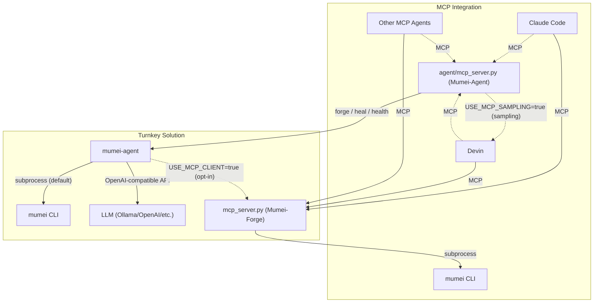
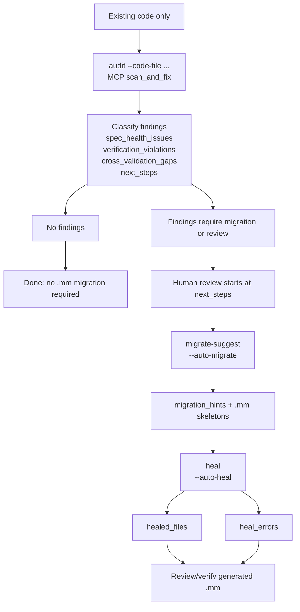

# Mumei Agent

AI-driven autonomous fix loop for the [Mumei](https://github.com/mumei-lang/mumei)
proof-driven programming language. Combines LLM (Qwen/Ollama/OpenAI) with Z3 formal
verification to automatically detect and fix code issues.

## Background

This repository was extracted from the [mumei](https://github.com/mumei-lang/mumei)
compiler repository. The self-healing agent and Streamlit visualizer were originally
developed in-tree and moved here as a standalone project
(see [mumei-lang/mumei#90](https://github.com/mumei-lang/mumei/pull/90)).

## Cross-project harness vocabulary

`mumei-lang/mumei/docs/CROSS_PROJECT_ROADMAP.md` is the single top-level roadmap. Agent docs and MCP contracts use the same canonical field names: `harness_contract`, `intent_fidelity`, `artifact_paths`, `budget_policy_fingerprint`, and `lean_verified`. Audit/spec tooling additionally uses the stable audit keys `spec_health_issues`, `verification_violations`, `cross_validation_gaps`, `next_steps`, `migration_hints`, `healed_files`, and `heal_errors`, plus `contradiction_type` values `spec_internal`, `spec_overconstraint`, `spec_vacuity`, and `spec_vs_code`; do not introduce aliases in README, CLI help, or MCP tool descriptions.

`mumei-agent audit --code-file ... --auto-migrate --auto-heal` and MCP `scan_and_fix` are the same no-`.mm` contract: `audit` emits `spec_health_issues` / `verification_violations` / `cross_validation_gaps` / `next_steps`, `migrate-suggest` emits `migration_hints`, and `heal` records `healed_files` / `heal_errors`.

## Architecture

```
mumei CLI (Z3 verification)
  ^ subprocess: mumei check / mumei verify --json
  |
agent/self_healing.py (heal mode)     agent/generate.py (generate mode)
  ^ OpenAI-compatible API               ^ OpenAI-compatible API
  |                                      |
Ollama + Qwen (LLM inference)          Ollama + Qwen (LLM inference)
  ^ Docker Compose                       ^ Docker Compose
  |                                      |
docker-compose.yml                     docker-compose.yml
```

### Generate Flow

```
spec.json (atom specification)
  |
agent/generate.py (CLI entry point)
  |
agent/strategies/generate_strategy.py
  |  1. LLM generates .mm code from spec
  |  2. mumei check (parse validation)
  |  3. mumei verify --json (formal verification)
  |  4. If failed: LLM fixes code, goto 2
  |  5. Repeat up to max_retries
  |
output.mm (generated Mumei code, exit 0 if verified)
  |
mumei build output.mm --emit <target>
  Emitter Plugin Architecture により複数ターゲットへ出力可能:
    --emit llvm-ir   → LLVM IR (default, native binary)
    --emit c-header  → C header (.h) for FFI interop
  See: mumei docs/CROSS_PROJECT_ROADMAP.md "Emitter Plugin Architecture"
```

## Relationship with MCP Server / Other AI Agents

**mumei-agent** is a turnkey solution — it integrates LLM calls, `mumei verify`, and retry logic into a single autonomous fix loop. It invokes the mumei CLI directly via subprocess (no MCP required).

The [mumei](https://github.com/mumei-lang/mumei) compiler repository also ships an **MCP Server** (`mcp_server.py`, implemented as FastMCP("Mumei-Forge")), which allows any MCP-compatible AI agent (Claude Code, Devin, Codex, Qwen, etc.) to access mumei's verification capabilities directly over the Model Context Protocol. The agent MCP server complements that with proof-friendly specification guidance so clients can request decidable-fragment hints before generating contracts.



By default, `agent/mcp_server.py` uses the same OpenAI-compatible LLM endpoint
as the CLI.  Set `USE_MCP_SAMPLING=true` to make all LLM-backed MCP tools
request completion through standard MCP sampling
(`Context.session.create_message`) from the connected client instead.  This
lets Devin or another MCP client provide the LLM role without configuring
`LLM_API_KEY` in mumei-agent.  If the connected client does not support
sampling, or sampling fails, the agent falls back to the existing
OpenAI-compatible path.  Tools that support this path include `heal_file`,
`forge_task`, `extract_spec`, `self_correct`, `validate_nl_spec`,
`validate_nl_spec_multi`, `validate_code`, `validate_foreign_code`,
`verify_foreign_code`, `validate_spec_to_code`, `validate_code_to_spec`,
`verify_conformance`, `verify_code_spec_traceability`, `audit_code`,
`scan_and_fix`, and `extract_spec_from_code`.

The implementation follows the MCP 2025-11-25 sampling specification for basic
text generations: user/assistant chat messages are converted to
`SamplingMessage` text content, system messages become `systemPrompt`, model
names are passed as `modelPreferences.hints`, and `maxTokens` is bounded by
`MCP_SAMPLING_MAX_TOKENS`.  The server checks the client's initialization
`capabilities.sampling` before sending sampling requests — preferring the public
`session.client_params` / `session.check_client_capability()` API and falling
back to the private `session._client_params` attribute for older SDK versions.  It intentionally omits
`includeContext`, sampling tools, images, and audio until the corresponding
client capabilities (`sampling.context` or `sampling.tools`) and concrete
forge/heal use cases are covered by tests.  The `includeContext` values
`"thisServer"` and `"allServers"` are soft-deprecated in the 2025-11-25 spec,
so this path leaves context inclusion at its default (`"none"`).

The `mumei/mcp_server.py` **Mumei-Forge** server remains verification-only and
does not need an LLM provider; sampling is implemented only in
`mumei-agent` so the forge/heal autonomous loop is not duplicated in the compiler
repository.

### When to Use Which

- **mumei-agent**: Run `uv run mumei-agent file.mm` for a fully automated fix loop. LLM provider is configured via `.env` (Ollama, OpenAI, DashScope, etc.). Best when you want a single-command experience.
- **MCP Server**: Start `python mcp_server.py` in the [mumei repository](https://github.com/mumei-lang/mumei) and connect from any MCP-compatible agent. The agent calls tools like `validate_logic`, `forge_blade`, and `get_inferred_effects`, and uses its own LLM to decide how to fix issues. Best when you already use an MCP-capable agent and want to integrate mumei verification into your existing workflow.

Both approaches are **complementary** — choose based on your use case, or combine them as needed.

## Prerequisites

- [Mumei](https://github.com/mumei-lang/mumei) installed and available in PATH
  - Or: clone mumei repo and use `cargo run --` mode
- Docker (for Ollama)
- Python 3.11+

## Quick Start

```bash
# 1. Start Ollama container
docker compose up -d
docker exec mumei-ollama ollama pull qwen3.5

# 2. Configure environment
cp .env.example .env
# Edit .env to select your LLM provider (default: Ollama local)

# 3. Install dependencies
brew install uv  # if not already installed
uv sync
# After uv sync, use `uv run mumei-agent <subcommand>` from this checkout.

# 4. Run self-healing loop (uses examples/sword_test.mm by default)
uv run mumei-agent heal

# Or specify a file explicitly:
uv run mumei-agent heal examples/effect_test.mm

# Optional: bound retries with an explicit P8-G budget policy
uv run mumei-agent heal examples/effect_test.mm --budget-policy budget_policy.json

# P9-F: repair with mumei Loss Vector feedback
uv run mumei-agent self-correct examples/effect_test.mm --max-iterations 3

# 5. Generate new code from a specification
uv run mumei-agent generate --spec-file examples/spec.json --output out.mm

# 6. (Optional) Start Streamlit visualizer
uv run streamlit run visualizer/app.py
```

You can also run commands as `mumei-agent ...` after activating the uv-managed virtual environment with `source .venv/bin/activate`.

## No-.mm entry: one audit contract

`mumei-agent audit --code-file ... --auto-migrate --auto-heal` and MCP `scan_and_fix` are the same contract. They both run the same three-stage path:

1. `audit`: accept existing code only, extract candidate specs, and classify findings.
2. `migrate-suggest` / `--auto-migrate`: emit `.mm` skeleton guidance only for findings that need migration.
3. `heal` / `--auto-heal`: run self-healing on those generated skeletons and report the outcome.

Canonical result keys are fixed as follows:

Language support is split into two layers:

| Layer | Scope | Supported languages |
|-------|-------|---------------------|
| Layer A (spec extraction) | `extract-spec --code-file`, `extract_spec_from_code` MCP, LLM/regex-based NL spec extraction | `rust`, `c`, `cpp`, `go`, `python`, `javascript`, `typescript`, `java`, `solidity` |
| Layer B (Z3 strict verification) | `validate-code`, `validate-spec-to-code`, `validate-code-to-spec`, `audit`, `scan_and_fix` MCP | `python`, `rust`, `typescript`, `go`, `solidity` |

Layer A uses LLM and regex heuristics to extract natural-language specifications from code. Layer B uses Z3 SMT solver and deterministic foreign-code parsers for strict contract verification. Languages supported only by Layer A (c, cpp, java, javascript) can be used for spec extraction but will receive an informative error if passed to Layer B tools.

`audit`, `validate-code`, `validate-spec-to-code`, `validate-code-to-spec`, and MCP `scan_and_fix` use the same fixed keys for all five Layer B languages; Rust overflow/bounds findings, TypeScript null/undefined findings, Go bounds/nil/overflow findings, and Solidity `uint256`/`int256` overflow and array-bounds findings appear in `verification_violations` with Z3 counterexamples when the deterministic parser can prove an unsafe path. Solidity support covers function-level pre/postconditions and 256-bit overflow/bounds; smart-contract-specific state-machine checks (reentrancy, access control, Checks-Effects-Interactions) are out of scope and tracked separately in the roadmap. LLM credentials are optional: when no key is configured, the deterministic parser still extracts signatures, safety preconditions, and postcondition candidates.

| Key | Meaning |
| --- | --- |
| `spec_health_issues` | Spec-only contradictions, overconstraints, vacuity, or ambiguity in extracted/provided specs; these do not require existing-code execution to be meaningful. |
| `verification_violations` | Existing-code bugs or unsafe paths found before `.mm` migration by checking inferred/extracted contracts against the source. |
| `cross_validation_gaps` | Spec↔code mismatches: missing constraints, stronger/weaker behavior, or cross-spec drift that still needs migration or review. |
| `next_steps` | The human-review entrypoint: prioritized actions and commands reviewers should run before accepting migration or healing evidence. |
| `migration_hints` | `.mm` skeleton advice produced by `migrate-suggest` / `--auto-migrate` for functions attached to violations or gaps. |
| `healed_files` | Generated `.mm` skeleton files that the self-healing loop rewrote or accepted successfully. |
| `heal_errors` | Per-skeleton self-healing failures and diagnostics; these never change the meaning of the audit findings. |



Use the one-command CLI form when you want audit, skeleton generation, and healing evidence together:

```bash
mumei-agent audit --code-file src/ --auto-migrate --auto-heal --heal-output-dir out/
```

MCP clients call the same contract with `scan_and_fix`:

```json
{
  "code_file": "src/",
  "language": "python",
  "auto_heal": true,
  "heal_output_dir": "out/"
}
```

`next_steps` is the only handoff into human review. Do not add aliases for `spec_health_issues`, `verification_violations`, `cross_validation_gaps`, `next_steps`, `migration_hints`, `healed_files`, or `heal_errors`; downstream docs, MCP responses, and demo JSON should consume those names exactly.

For manual review, run the same stages separately:

```bash
mumei-agent audit --code-file src/foo.py --language python
mumei-agent migrate-suggest --code-file src/foo.py --language python --output generated/mm
mumei-agent heal generated/mm/foo.mm
```

Demo wording for no-`.mm` user-facing material is fixed to these three phrases:

1. 既存コードを渡すだけでバグ箇所を指摘
2. 仕様から既存コードとの差分を指摘
3. 仕様単独でおかしい場合を指摘

## P9 NLAE Integration

P9-F and P9-G connect mumei-agent to the four-repository NLAE pipeline:

```text
spec / intent
  ↓
mumei-agent NLAEPipeline (Module A / AV)
  ↓ generated .mm
mumei verify --emit loss-vector (Module B / AR)
  ↓ Loss Vector JSON
mumei-agent self-correct
  ↓ proof certificate
mumei-lean Fidelity Checker
  ↓
mumei-demo Evaluation Loop
```

Run the Loss Vector driven self-correction loop directly:

```bash
uv run mumei-agent self-correct examples/effect_test.mm --max-iterations 3
```

MCP clients can run the full P9-G integration with `run_nlae_pipeline`:

```json
{
  "spec": "vault withdraw safety",
  "mumei_lean_repo": "../mumei-lean",
  "work_dir": ".nlae-work",
  "no_build": true
}
```

## Configuration

Core agent and local Ollama settings are controlled through environment variables
(`.env` is loaded automatically):

- `LLM_API_KEY` / `OPENAI_API_KEY`, `LLM_BASE_URL`, `LLM_MODEL`: select the
  OpenAI-compatible LLM endpoint. For local Ollama, set `LLM_BASE_URL` to
  `http://localhost:11434/v1`.
- `USE_MCP_SAMPLING` (default: `false`): for `agent/mcp_server.py` tool calls,
  ask the connected MCP client (for example Devin) to provide completions via
  MCP sampling. All LLM-backed MCP tools support this path; OpenAI-compatible
  settings remain the fallback.
- `MCP_SAMPLING_MAX_TOKENS` (default: `4096`): maximum `maxTokens` sent in MCP
  sampling requests.
- `MAX_CONTEXT_TOKENS` (default: `16000`): operator-facing estimate for the
  maximum prompt budget to send to the LLM. Use this to align prompt construction
  with the model/context window selected for your backend.
- `PROMPT_REPORT_TRUNCATE_CHARS` (default: `4000`): maximum number of characters
  embedded from verifier retry context. Retry prompts prefer actionable fix hints
  and structured unsat cores instead of raw JSON dumps to keep long-context runs
  focused on repair-relevant evidence.

### OpenTelemetry Observability (opt-in, P15 Phase 1-6)

Distributed tracing and token/latency metrics are **opt-in** and default to off.
Without the extra installed or with `OTEL_ENABLED` unset, every LLM/tool span
and metric instrument falls back to a NoOp implementation, so the heal /
generate / forge / proliferate flows run byte-for-byte identically.

> **Operations guide:** see [`docs/OBSERVABILITY.md`](docs/OBSERVABILITY.md) for
> the reference OTLP backend stack (`docker compose -f docker-compose.otel.yml up`
> → Collector / Jaeger / Prometheus / Grafana), the Grafana dashboard, the span
> hierarchy + metrics catalogue, and the end-to-end distributed-trace
> verification procedure (mumei-agent → `mumei verify` → Rust Z3).

```bash
# Install the optional OTel dependencies
uv sync --extra otel        # or: pip install mumei-agent[otel]

# Enable and point at an OTLP backend (Jaeger, Grafana Tempo, etc.)
export OTEL_ENABLED=true
export OTEL_EXPORTER_OTLP_ENDPOINT=http://localhost:4317
uv run mumei-agent heal examples/effect_test.mm
```

- `OTEL_ENABLED` (default: `false`): master switch. Instrumentation is active
  only when this is truthy **and** the `opentelemetry` packages are importable;
  otherwise NoOp tracers/meters are used.
- `OTEL_EXPORTER_OTLP_ENDPOINT`: standard OTLP endpoint the SDK exports
  traces/metrics to (honored by the `opentelemetry` SDK).
- `OTEL_EXPORTER_OTLP_PROTOCOL` (default: `grpc`): OTLP wire protocol. Set to
  `http/protobuf` (or any `http*` value) to use the HTTP exporters instead of
  gRPC.

Phase 1 instruments all LLM call sites: `OpenAILLMProvider.complete` and
`McpSamplingLLMProvider.complete` emit spans with `gen_ai.request.model`,
`gen_ai.system`, `server.address`, and `gen_ai.usage.total_tokens`; token usage
is also reported to the `gen_ai.usage.total_tokens` counter (tagged with the
`gen_ai.request.model` attribute) as a parallel channel that never changes the
JSON metrics output
(`Metrics.to_dict()` / `HarnessMetrics.aggregate_metrics()`). MCP sampling
requests carry a W3C `traceparent` in their metadata for cross-process trace
propagation. `McpSamplingLLMProvider.complete_with_tools` has its own
`mcp_sampling.complete_with_tools` span with `tool_count` and `tool_choice`
attributes. The dispatch functions `complete_text` / `complete_response` emit
`llm.complete_text` / `llm.complete_response` spans with `gen_ai.dispatch_path`
identifying the routing decision. All 8 direct `client.chat.completions.create`
call sites (spec refinement, multi-stage fix, diagnose, CEGIS invariant
synthesis, spec extraction, code-to-spec, dense property generation, ambiguity
detection) are individually instrumented with `llm.*` spans.

Phase 2 instruments the Z3 verification subprocess calls in `MumeiClient` and
`MumeiMCPClient`. Every CLI subprocess call is wrapped in an OTel span
(`mumei.verify`, `mumei.check`, `mumei.infer_effects`, `mumei.infer_contracts`,
`mumei.build`) with attributes `mumei.command`, `mumei.source_path`,
`mumei.exit_code`, `mumei.duration_ms`, `mumei.stdout.size`, and
`mumei.stderr.size`. The `mumei.verify` span additionally carries
`mumei.verification.duration_ms`, `mumei.collect_decidable_metrics`,
`mumei.decidable_fragment.present`, and `mumei.loss_vector.present`.  Failed
verifications that trigger a loss-vector re-run produce a child span
`mumei.verify.loss_vector`.  `MumeiMCPClient` wraps the same methods under
`mumei.mcp.*` span names (`mumei.mcp.verify`, `mumei.mcp.check`, etc.) so MCP
routing and CLI execution appear as distinct layers in the trace.  Verification
wall-clock time is also reported to the `mumei.verify.duration` histogram
(unit: seconds) as a parallel OTel metrics channel that never changes the
`Metrics.to_dict()` JSON output.

Phase 3 adds per-loop root spans and `ThoughtProcess` span event mapping:

- **`mumei.loop.generate`** — wraps the `generate_code` / `generate_multi_atom`
  retry loop in `generate_strategy.py`. Attributes: `mumei.loop.type=generate`,
  `mumei.strategy` (`single` / `multi-stage`), `mumei.loop.max_retries`,
  `mumei.loop.final_success`, `mumei.loop.attempt`.
- **`mumei.loop.heal`** — wraps the `main()` heal loop in `self_healing.py`.
  CEGIS repair, Meta-Architect refactor, and LLM fix branches emit span events.
  Attributes: `mumei.loop.stop_reason` (`success` / `max_retries_exhausted` /
  `budget_denied`), `mumei.loop.final_success`, `mumei.loop.attempt`.
- **`mumei.loop.self_correction`** — wraps
  `StructuredFeedbackSelfCorrectionLoop.run` in `self_correction.py`.
  `stop_reason` (`converged` / `max_retries_reached` / `token_cost_exceeded` /
  `no_fix_produced` / `hard_repair_limit_reached`) is mapped to
  `mumei.loop.stop_reason`.
- **`mumei.loop.self_correction_strategy`** — wraps
  `SelfCorrectionStrategy.run` in `self_correction_strategy.py`.
  `action_class` / `budget_policy` decisions are emitted as span events;
  `mumei.budget_policy.fingerprint` is set as a span attribute.
- **`ThoughtProcess.add_step()`** emits an OTel span event on the current span
  for each verification step (`initial_verify`, `re_verify`, `llm_fix`).
  `to_dict()` output is unchanged.

Phase 4 instruments the MCP server tool entry points so external MCP clients
(Claude Code, Devin, ...) become the top of a single distributed trace. Each
instrumented tool opens an `mcp.tool.<name>` span (e.g. `mcp.tool.forge_task`,
`mcp.tool.heal_file`, `mcp.tool.self_correct`, `mcp.tool.run_nlae_pipeline`,
`mcp.tool.audit_code`, `mcp.tool.scan_and_fix`,
`mcp.tool.extract_spec_from_code`, plus the lightweight
`mcp.tool.measure_std_health` / `mcp.tool.propose_forge_tasks` /
`mcp.tool.list_forge_log` / `mcp.tool.get_agent_status`) carrying
`mcp.tool.name` and tool-specific attributes (`mcp.tool.dry_run` /
`mcp.tool.task_id` / `mcp.tool.status` for `forge_task`, `mumei.heal.kind` for
`heal_file`, `mcp.tool.max_iterations` for `self_correct`, `mcp.tool.no_build`
for `run_nlae_pipeline`, `mcp.tool.generate` for `extract_spec_from_code`,
`mumei.language` for `audit_code` / `scan_and_fix`). Directory heals additionally
emit a per-file `mcp.tool.heal_file.file` child span. Because the entry span is
the current span, the P15-3 loop root spans (`mumei.loop.*`) and P15-2 verify
spans (`mumei.verify`) nest underneath it automatically.

`telemetry.extract_trace_context(carrier)` is the inverse of
`inject_trace_context`: given a W3C `traceparent` / `tracestate` carrier it
returns the OTel `Context` to start the entry span as a child of. An external
MCP client connects its trace by attaching `traceparent` / `tracestate` to the
request `_meta`; the server reads it via `ctx.request_context.meta`
(`_carrier_from_ctx`) and parents the `mcp.tool.<name>` span on it, so
**MCP client → tool → inner loop → verify subprocess → LLM** appear as one
trace. When no context is present the entry span behaves as a fresh root
(backward compatible). With `OTEL_ENABLED` unset, `extract_trace_context`
returns `None` and every entry span is a NoOp, so tool JSON payloads are
unchanged.

Phase 5 connects existing JSON metrics to OTel Metrics as a parallel channel.
The `Metrics`, `HarnessMetrics`, and `run_lean_bridge` code paths now emit the
following instruments (all no-op when disabled):

| Instrument | Type | Source |
|---|---|---|
| `mumei.verify.duration` | Histogram (s) | `Metrics.record_verification_time` |
| `mumei.first_pass.success_rate` | Histogram (1) | `Metrics.record_new_spec` |
| `mumei.z3.unknowns` | Counter | `Metrics.record_new_spec` |
| `mumei.decidable_fragment.warnings` | Counter | `Metrics.record_new_spec` |
| `mumei.fix.attempts` | Counter | `Metrics.record_attempt` |
| `mumei.fix.successes` | Counter | `Metrics.record_success` |
| `mumei.harness.tokens_to_success` | Histogram | `HarnessMetrics.record_stage` |
| `mumei.harness.solver_seconds_to_success` | Histogram (s) | `HarnessMetrics.record_stage` |
| `mumei.harness.spec_drift_score` | Histogram (1) | `HarnessMetrics.record_stage` |
| `mumei.lean.bridge.duration` | Histogram (s) | `run_lean_bridge` |
| `mumei.lean.verified_count` | Counter | `run_lean_bridge` |
| `mumei.lean.bridge.error_code` | Counter | `run_lean_bridge` |

Dimension attributes: `mumei.violation_type` on fix counters,
`stage`/`module`/`profile` on harness histograms, `mumei.lean.error_code` on
bridge error counter.  `to_dict()` / `aggregate_metrics()` / return-value dicts
remain byte-for-byte identical; OTel is purely additive.

**Dashboard example** (Grafana / Prometheus OTLP receiver):

```promql
# Fix success rate by violation type
sum(rate(mumei_fix_successes_total[5m])) by (mumei_violation_type)
/ sum(rate(mumei_fix_attempts_total[5m])) by (mumei_violation_type)

# P95 verify duration
histogram_quantile(0.95, rate(mumei_verify_duration_seconds_bucket[5m]))

# Lean bridge error rate
sum(rate(mumei_lean_bridge_error_code_total[5m])) by (mumei_lean_error_code)
```

Phase 6 wraps the three long-running Python pipelines in root/child spans so a
single proliferate / NLAE / audit run appears as one hierarchical trace, with
the P15-2 `mumei.verify` and P15-3 `mumei.loop.*` spans nesting underneath
automatically. All spans are `is_enabled()`-guarded, NoOp when OTel is disabled
or the extra is not installed, and swallow exceptions; `proliferate()`'s
`summary.json`, `NLAEResult.to_dict()`, and the `AuditResult` /
`AuditDirectoryResult` dataclasses are unchanged.

- **`mumei.proliferate`** — wraps the whole `proliferate()` weekly run.
  Attributes: `mumei.proliferate.max_proposals`, `mumei.proliferate.dry_run`,
  `mumei.proliferate.harness_profile`, `mumei.proliferate.proposals_found`.
  Child spans: `mumei.proliferate.gap_analysis`,
  `mumei.proliferate.spec_generation`, `mumei.proliferate.forge`, and
  `mumei.proliferate.lean_fallback`. Because `_parallel_forge` runs on a
  `ThreadPoolExecutor`, the submitting thread's context is captured with
  `telemetry.capture_context()` and re-attached in each worker via
  `telemetry.use_context()`, so every `mumei.proliferate.forge.candidate`
  worker span (attributes `mumei.proliferate.target_file`,
  `mumei.proliferate.verified`, `mumei.proliferate.cache_hit`) parents onto the
  `mumei.proliferate.forge` span rather than becoming an orphan root. Each
  publish iteration opens a `mumei.proliferate.proposal` span
  (`mumei.proliferate.target_file`, `mumei.proliferate.verified`,
  `mumei.proliferate.blast_radius_broken`, `mumei.proliferate.healed`).
- **`mumei.nlae.pipeline`** — wraps `NLAEPipeline.run_full_pipeline`. The four
  stages are child spans `mumei.nlae.generate`, `mumei.nlae.verify`,
  `mumei.nlae.self_correction`, and `mumei.nlae.lean_bridge`. Attributes:
  `mumei.nlae.verified`, `mumei.nlae.lean_verified`,
  `mumei.nlae.loss_vector.present`. The root span's 32-hex trace ID is surfaced
  on the new optional `NLAEResult.trace_id` field (default `None`, present only
  as the last dataclass field so `to_dict()` stays backward compatible). When
  the pipeline is invoked through the `run_nlae_pipeline` MCP tool, that
  `mcp.tool.run_nlae_pipeline` entry span is the current span, so
  `mumei.nlae.pipeline` nests underneath it and `trace_id` lets a caller follow
  the distributed trace back to the originating MCP request across the
  mumei-agent / mumei / mumei-lean / mumei-demo repositories.
- **`mumei.audit.file` / `mumei.audit.directory` / `mumei.audit.source`** — wrap
  `AuditPipeline.audit_file` / `audit_directory` / `audit_source`. A directory
  audit's per-file `audit_file` calls appear as sequential `mumei.audit.file`
  child spans under the `mumei.audit.directory` span. Attributes:
  `mumei.audit.language`, `mumei.audit.success`, `mumei.audit.violations`
  (file / source) and `mumei.audit.files_with_issues` (directory).

The Rust compiler-side integration is now implemented: when the `mumei` binary
is built with `--features otel` and `OTEL_ENABLED=true`, `MumeiClient` methods
automatically inject `TRACEPARENT` into the subprocess environment. The Rust
side extracts this context and parents its `mumei.verify.cli` / `mumei.z3.solve`
spans under the Python caller's span, creating a single end-to-end distributed
trace from **MCP client → mumei-agent → mumei verify → Z3**.

### Ollama KV cache and long-context tuning

`docker-compose.yml` configures the Ollama service with:

```yaml
OLLAMA_KV_CACHE_TYPE: q8_0
OLLAMA_NUM_CTX: "32768"
```

`OLLAMA_KV_CACHE_TYPE=q8_0` uses the KV-cache quantization currently available
through llama.cpp/Ollama-compatible backends, roughly halving KV-cache memory
versus FP16 and allowing longer context before memory exhaustion. `OLLAMA_NUM_CTX`
raises the context target from the common 2048 default to 32768; lower it on
memory-constrained machines or raise it only after confirming enough GPU/CPU RAM.

TurboQuant and PolarQuant show that stronger KV-cache compression is plausible:
TurboQuant uses randomized rotation plus scalar quantization and reports neutral
quality at about 3.5 bits/channel for KV cache, while PolarQuant uses random
preconditioning plus polar-coordinate angle quantization and reports over 4.2x
KV-cache compression on long-context evaluations. Once those methods are exposed
by llama.cpp/Ollama as stable cache types, replace `q8_0` with the backend's
published type name (for example a future `turbo*_0`/`polar*_0` cache type) and
re-benchmark quality, latency, and maximum context before making it the default.

## Retry Budget Policy (P8-G)

Self-healing uses a budget-aware loop to avoid unbounded token spend, repeated solver work, and false success from spec weakening. By default it uses a conservative in-code policy; pass `--budget-policy` to load JSON:

```json
{
  "max_attempts": 5,
  "max_tokens": 10000,
  "max_solver_time_ms": 30000,
  "max_semantic_delta": 0.5,
  "action_class_limits": {
    "llm_fix": { "max_attempts": 3, "max_tokens": 5000, "max_lean_escalations": 0 },
    "lean_escalation": { "max_attempts": 1, "max_tokens": 5000, "max_lean_escalations": 1 }
  }
}
```

When the budget is exhausted or the same counterexample signature repeats without new information, the loop suppresses another LLM call and prints a structured `manual_review_required` summary containing the policy fingerprint, attempt counts, token/solver usage, spec drift score, and recommended action class. Successful runs aggregate `attempts_to_success`, `tokens_to_success`, `solver_seconds_to_success`, and `spec_drift_score` for quarterly feedback tuning.

## Examples

The `examples/` directory contains sample `.mm` files with known verification
failures for testing the self-healing loop:

| File | Violation Type | Description |
|---|---|---|
| `examples/sword_test.mm` | Precondition | Division without `b != 0` guard |
| `examples/effect_test.mm` | Effect mismatch | Uses `FileWrite` but only declares `[Log]` |

```bash
# Demo: precondition fix
uv run mumei-agent heal examples/sword_test.mm

# Demo: effect mismatch fix
uv run mumei-agent heal examples/effect_test.mm

# Backward compatible (no subcommand = heal mode)
uv run mumei-agent examples/sword_test.mm
```

## Generate Mode

The `generate` subcommand creates new Mumei code from a JSON specification.
It uses an LLM to generate code, then verifies it with `mumei check` and
`mumei verify --json`, auto-fixing any issues.

### Spec JSON Format

```json
{
  "name": "safe_read",
  "params": [{"name": "path", "type": "Str"}],
  "effects": ["SafeFileRead(path)"],
  "requires": "starts_with(path, \"/tmp/\") && not_contains(path, \"..\")",
  "ensures": "result >= 0",
  "description": "Read a file safely with path traversal prevention"
}
```

### Usage

```bash
# From a spec file
uv run mumei-agent generate --spec-file spec.json --output out.mm

# From inline JSON
uv run mumei-agent generate --spec '{"name": "add", "params": [{"name": "a", "type": "i64"}, {"name": "b", "type": "i64"}], "requires": "true", "ensures": "result == a + b"}' --output add.mm

# With metrics output
uv run mumei-agent generate --spec-file spec.json --output out.mm --metrics
```

### Metrics

Use the `--metrics` flag to output a JSON summary of generation/fix statistics:

```json
{
  "total_attempts": 3,
  "successes": 1,
  "by_violation_type": {
    "generation": {"attempts": 1, "successes": 1},
    "effect_mismatch": {"attempts": 2, "successes": 0}
  }
}
```

## E2E Demo

https://github.com/user-attachments/assets/908ae828-d249-4967-b9b0-55d56dd3d95e

The self-healing loop follows this interaction flow:

1. **Verification failure**: `mumei build` detects a precondition bug (missing `b != 0` guard)
2. **LLM fix**: The agent sends the Z3 counter-example to the LLM, which generates a corrected `requires` clause
3. **Re-verification**: `mumei build` confirms the fix passes formal verification

### Spec-to-Verified-Code E2E Demo

The `examples/run_e2e_demo.py` script demonstrates the full pipeline: specification
JSON -> LLM code generation -> mumei verify -> self-healing loop -> verified output.

```bash
# Dry-run mode (validate spec only, no LLM or mumei required)
python -m examples.run_e2e_demo --dry-run
python -m examples.run_e2e_demo examples/simple_add_spec.json --dry-run

# Full pipeline (requires LLM API key and optionally mumei binary)
python -m examples.run_e2e_demo                                # uses e2e_demo_spec.json
python -m examples.run_e2e_demo examples/simple_add_spec.json  # minimal example
```

Available spec files:

| File | Description | Effects |
|---|---|---|
| `examples/e2e_demo_spec.json` | Fetch GitHub user via HTTPS | `SecureHttpGet` |
| `examples/simple_add_spec.json` | Add two non-negative numbers | None |

### P11 Natural-language Specification Extraction

See [`docs/NL_SPEC_DEMO.md`](docs/NL_SPEC_DEMO.md) for a recorded field demo of `uv run mumei-agent extract-spec`, including bank-transfer, RegTech KYC, and spec-extraction-to-code-generation examples with `mumei verify` output.

Use contradiction-only mode when you want to validate natural-language requirements before generating code:

```bash
uv run mumei-agent extract-spec \
  --text "x must be greater than 0 and less than 0" \
  --domain math \
  --output contradiction-report.json \
  --check-contradiction-only
```

This extracts the forge-task spec, builds temporary trusted atoms from the extracted contracts, runs Mumei spec satisfiability, and writes `contradiction_found`, `natural_language_explanation`, and the raw verification payload to the output JSON. It skips `.mm` code generation and self-healing entirely.

https://github.com/user-attachments/assets/7426e5e0-c9ac-4c30-a267-012ad8b0ffdd

A live OpenAI extraction E2E recording is available at [`docs/p11_live_extraction_e2e.mp4`](docs/p11_live_extraction_e2e.mp4).

## LLM Provider Support

| Provider | Config Pattern | Cost |
|---|---|---|
| Ollama (local) | Pattern 1 | Free |
| External API (DashScope etc.) | Pattern 2 | Pay-per-use |
| vLLM (local) | Pattern 3 | Free |
| OpenAI | Pattern 4 | Pay-per-use |

See `.env.example` for configuration details.

## Subcommands

| Command | Description | Example |
|---|---|---|
| `heal` (default) | Self-healing loop for existing .mm files | `mumei-agent heal examples/sword_test.mm` |
| `self-correct` | P9-F Loss Vector driven self-correction loop | `mumei-agent self-correct examples/effect_test.mm --max-iterations 3` |
| `generate` | Generate new .mm code from spec JSON | `mumei-agent generate --spec-file spec.json --output out.mm` |
| `audit` | Audit existing code or directories: extract spec, check health, verify contracts, detect cross-validation gaps | `mumei-agent audit --code-file src/ --auto-migrate --auto-heal` |
| `migrate-suggest` | Generate .mm migration skeletons for functions with verification issues | `mumei-agent migrate-suggest --code-file src/foo.ts --language typescript` |
| `publish` | Autonomous delivery: generate → verify → emit wrappers → PR | `mumei-agent publish --spec examples/publish_demo/payment_spec.json --dry-run` |
| `forge` | Autonomously extend the mumei std library with verified atoms | `mumei-agent forge --tasks-dir forge_tasks/ --mumei-repo ../mumei --max-tasks 1` |
| `validate-spec` | Cross-validate natural-language specs for contradiction, ambiguity, over-constraint, and Z3 satisfiability | `mumei-agent validate-spec --input spec.txt --format nl` |
| `validate-code` | Infer and verify contracts from existing code (Python, Rust, TypeScript, Go). `--language` is optional; inferred from extension when omitted | `mumei-agent validate-code --input code.ts` |
| `validate-spec-to-code` | Detect missing implementation constraints by comparing specs to code | `mumei-agent validate-spec-to-code --spec spec.txt --code src/foo.py --language python` |
| `validate-code-to-spec` | Detect spec drift by comparing changed code to specs | `mumei-agent validate-code-to-spec --code src/foo.py --spec spec.txt --language python` |
| `verify-conformance` | Produce the V1-C spec→code conformance matrix and next_steps-first report | `mumei-agent verify-conformance --spec spec.txt --code src/foo.py --language python --format human` (python\|rust\|typescript\|go) |
| `verify-traceability` | Combine V1-C conformance and V1-D drift into one bidirectional traceability summary | `mumei-agent verify-traceability --code src/foo.py --spec spec.txt --language python --format human` (python\|rust\|typescript\|go) |
| `check-spec-health` | Check a Mumei spec for contradictions, over-constraints, and vacuity | `mumei-agent check-spec-health spec.mm` |
| `mcp-server` | Run mumei-agent as a FastMCP server (forge / heal / health / propose tools) | `mumei-agent mcp-server` |

## Verification Workflow Guide

ユースケース別の検証手順（自然言語仕様の矛盾チェック、既存コードの検証、仕様↔コード整合性検証、人間向け操作ガイド）は [`docs/VERIFICATION_WORKFLOW_GUIDE.md`](docs/VERIFICATION_WORKFLOW_GUIDE.md) を参照。

## MCP Server

`uv run mumei-agent mcp-server` runs mumei-agent as a `FastMCP("Mumei-Agent")`
server over stdio.  Any MCP-compatible client (Claude Code, Devin,
Codex, ...) can drive the same forge loop that the CLI exposes.

Exported tools:

| Tool | Description |
|---|---|
| `forge_task(task_json, mumei_repo, dry_run=true)` | Run a single forge spec (drop-in `MumeiForge.forge_one`) |
| `heal_file(source_code, error_report)` | Self-heal a `.mm` source via the existing fix-strategy pipeline |
| `measure_std_health(mumei_repo)` | Delegate to `agent.std_health.measure_health` |
| `propose_forge_tasks(mumei_repo, max_proposals=3)` | MCP-accessible `uv run mumei-agent propose --auto` |
| `list_forge_log(log_path)` | Read `forge_log.json` |
| `get_agent_status()` | Report LLM provider, mumei binary, available subcommands |
| `get_spec_guidelines()` | Return proof-friendly generation guidance for the Z3-stable decidable fragment and Lean escalation candidates |
| `scan_and_fix(code_file, language, spec="", auto_heal=False, ...)` | Same contract as `audit --code-file ... --auto-migrate --auto-heal`: audit a file/directory, return `cross_validation_gaps`, emit `migration_hints`, optionally self-heal |
| `extract_spec(natural_language, domain_hint="", generate=false, mumei_repo="", check_contradiction_only=false)` | Extract a forge spec, optionally generate code, or run contradiction-only validation |
| `check_spec_contradiction(natural_language, domain_hint="")` | Extract a natural-language spec and return `contradiction_type=spec_internal` for direct contradictions without code generation |
| `check_cross_spec_consistency(spec_files)` | Run cross-spec verification for a JSON array or comma-separated list of `.mm` files and return cross-validation evidence |
| `validate_code(code, language, use_llm=true, run_mumei=true)` | Infer and verify contracts from existing code (Layer B: Python, Rust, TypeScript, Go) |
| `verify_conformance(spec, code_path, language, use_llm=true, run_mumei=true)` | Return the V1-C conformance JSON with `next_steps` and no review aliases |
| `verify_code_spec_traceability(code_file, spec_text, language, use_llm=true, run_mumei=true)` | Return the V1-C/V1-D bidirectional traceability summary with `cross_validation_gaps`, `drift_score`, and `next_steps` |
| `self_correct(code_file, max_iterations=10)` | Run the P9-F Loss Vector self-correction loop for a `.mm` file |
| `run_nlae_pipeline(spec, mumei_lean_repo="", work_dir="", no_build=false)` | Run the P9-G NLAE pipeline: generate `.mm`, verify with `--emit loss-vector`, self-correct, then call the Lean Fidelity Checker |

`check_cross_spec_consistency` delegates to `mumei verify --cross-spec-files` and returns the parsed `cross_spec.json`, including contract consistency, global invariant conflicts, source file names, and dependency cycles.

Example `.mcp.json` snippet for Claude Code project MCP config:

```json
{
  "mcpServers": {
    "mumei-forge": {
      "command": "sh",
      "args": ["-lc", "cd ../mumei && exec python mcp_server.py"]
    },
    "mumei-agent": {
      "command": "sh",
      "args": ["-lc", "cd . && exec uv run mumei-agent mcp-server"]
    }
  }
}
```

The committed `.mcp.json` assumes the mumei compiler repository is checked out
as a sibling directory (`../mumei`).  Adjust that path if your workspace layout
differs.  The config intentionally uses `sh -lc "cd ... && exec ..."` instead
of a `cwd` field because Claude Code project MCP configs are most portable when
the working directory is set by the command itself.

### Proof-friendly specification guidance

`get_spec_guidelines()` exposes the same decidable-fragment guidance injected into generation prompts: prefer linear arithmetic, bounded array/sequence access, bounded quantifiers, and explicit finite temporal states. When a spec triggers `outside_decidable_fragment`, callers should simplify the contract, add explicit bounds or witnesses, or route the obligation to Lean.

P8-C metrics in `agent.metrics.Metrics` track how often new specifications fall outside the decidable fragment (`outside_decidable_fragment_warnings`, `z3_unknowns`, `first_pass_verification_success_rate`, and `by_logic_fragment`) so the guidance can be refreshed quarterly.

### Lean fallback diagnostics

Set `MUMEI_LEAN_REPO=/path/to/mumei-lean` to let `proliferate` escalate
`z3_check_result == "unknown"` atoms through the Lean bridge. The fallback contract matches `mumei-lean`: live-generated theorem path `Generated.Std.Math.Abs.abs_saturating_correct`, known-witness fallback `MumeiLean.StdMathAbs`, and stable failure classes `lake_missing`, `partial_translation`, and `stale_translator`. The fallback now
records retryability, per-error-code failure rates, proof-time distribution, and
partial-success status in the summary JSON. See
[`docs/LEAN_FALLBACK.md`](docs/LEAN_FALLBACK.md) for error-code meanings and
troubleshooting steps.

### MCP-backed verification (opt-in)

Set `USE_MCP_CLIENT=true` to make forge / heal / proliferate route their
verification through `agent.mcp_client.MumeiMCPClient` instead of the
raw `mumei verify --json` subprocess.  The MCP client returns the
richer semantic feedback the mumei MCP server formats (`semantic_feedback`,
`machine_readable`, `counter_example`, `effect_violation`).  Any failure
falls back to the subprocess client so the agent always works.

The client picks a transport automatically:

- **In-process** when the mumei repo is on `PYTHONPATH` (default in CI).
- **stdio subprocess** when `MUMEI_MCP_COMMAND` is set
  (e.g. `MUMEI_MCP_COMMAND="python /path/to/mumei/mcp_server.py"`).

### Unified gap analysis (`PREFER_MCP_GAPS`)

`agent/gap_rules.py` is the offline copy of the gap-rule logic from the
mumei MCP server's `analyze_std_gaps` tool.  Set `PREFER_MCP_GAPS=true`
(and put the mumei repo on `PYTHONPATH`) to make
`agent.proliferate.analyze_gaps` delegate to the authoritative
implementation in the mumei repo.  `proliferate.yml` already does this
in CI so the rule set is always in lockstep with whatever ships in
mumei.

## Forge Mode

`forge` extends the mumei [standard library](https://github.com/mumei-lang/mumei/tree/develop/std) with new verified atoms described in task spec JSON files.

```bash
# Preview the execution plan without running anything
uv run mumei-agent forge --tasks-dir forge_tasks/ --mumei-repo ../mumei --dry-run

# Run a single spec (path is looked up relative to --tasks-dir)
uv run mumei-agent forge --mumei-repo ../mumei --task vstd_safe_add.json

# Run the whole queue, capped at 5 tasks per invocation
uv run mumei-agent forge --tasks-dir forge_tasks/ --mumei-repo ../mumei --max-tasks 5
```

Each task spec declares a `target_file` inside the mumei repo, a `mode`
(`append`, `create`, or `replace`), and one or more `atoms`.  The orchestrator
drives `generate_code()` + `mumei verify --json` + self-healing, appends
(or creates/replaces) the target `.mm` file, optionally git-commits the
change, and records the outcome to `forge_log.json`.  Already-completed
`task_id`s are automatically skipped on subsequent runs.

Create/replace tasks whose atoms provide explicit `body` values and set
`deterministic_bodies: true` are rendered deterministically without requiring an
LLM credential; `vstd_core_predicates.json` and `vstd_crypto_primitives.json`
exercise this no-LLM path.

See [`forge_tasks/README.md`](forge_tasks/README.md) for the full task
spec schema.

## report.json Schema

This agent consumes the `report.json` output from `mumei verify --json`.
See [REPORT_SCHEMA.md](https://github.com/mumei-lang/mumei/blob/develop/docs/REPORT_SCHEMA.md)
for the full schema documentation.

## CI Verification Gate

mumei-agent includes a CI verification pipeline that automatically verifies `.mm` files in pull requests.

### Usage in your project

Add to your `.github/workflows/verify.yml`:

```yaml
name: Mumei Verify
on: [pull_request]
jobs:
  verify:
    uses: mumei-lang/mumei-agent/.github/workflows/mumei-verify.yml@develop
    with:
      proof-cert: true
```

Or use the standalone script:

```bash
python scripts/ci_verify.py src/*.mm --proof-cert
```

## Roadmap

See [`docs/ROADMAP.md`](docs/ROADMAP.md) for the agent-specific roadmap, and
[mumei-lang/mumei `docs/CROSS_PROJECT_ROADMAP.md`](https://github.com/mumei-lang/mumei/blob/develop/docs/CROSS_PROJECT_ROADMAP.md)
for the cross-project roadmap covering both the compiler and agent.

## License

[Apache-2.0 license](LICENSE)
