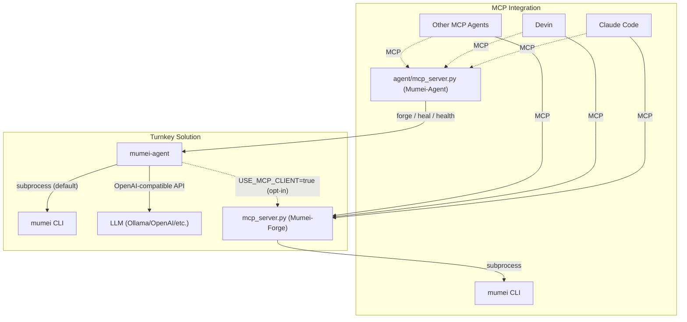
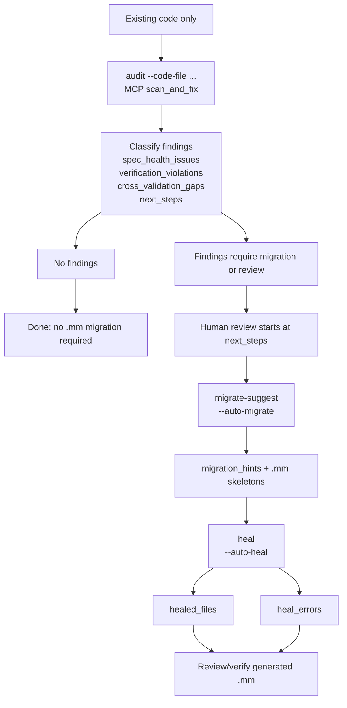

# Mumei Agent

AI-driven autonomous fix loop for the [Mumei](https://github.com/mumei-lang/mumei)
proof-driven programming language. Combines LLM (Qwen/Ollama/OpenAI) with Z3 formal
verification to automatically detect and fix code issues.

## Background

This repository was extracted from the [mumei](https://github.com/mumei-lang/mumei)
compiler repository. The self-healing agent and Streamlit visualizer were originally
developed in-tree and moved here as a standalone project
(see [mumei-lang/mumei#90](https://github.com/mumei-lang/mumei/pull/90)).

## Cross-project harness vocabulary

`mumei-lang/mumei/docs/CROSS_PROJECT_ROADMAP.md` is the single top-level roadmap. Agent docs and MCP contracts use the same canonical field names: `harness_contract`, `intent_fidelity`, `artifact_paths`, `budget_policy_fingerprint`, and `lean_verified`. Audit/spec tooling additionally uses the stable audit keys `spec_health_issues`, `verification_violations`, `cross_validation_gaps`, `next_steps`, `migration_hints`, `healed_files`, and `heal_errors`, plus `contradiction_type` values `spec_internal`, `spec_overconstraint`, `spec_vacuity`, and `spec_vs_code`; do not introduce aliases in README, CLI help, or MCP tool descriptions.

`mumei-agent audit --code-file ... --auto-migrate --auto-heal` and MCP `scan_and_fix` are the same no-`.mm` contract: `audit` emits `spec_health_issues` / `verification_violations` / `cross_validation_gaps` / `next_steps`, `migrate-suggest` emits `migration_hints`, and `heal` records `healed_files` / `heal_errors`.

## Architecture

```
mumei CLI (Z3 verification)
  ^ subprocess: mumei check / mumei verify --json
  |
agent/self_healing.py (heal mode)     agent/generate.py (generate mode)
  ^ OpenAI-compatible API               ^ OpenAI-compatible API
  |                                      |
Ollama + Qwen (LLM inference)          Ollama + Qwen (LLM inference)
  ^ Docker Compose                       ^ Docker Compose
  |                                      |
docker-compose.yml                     docker-compose.yml
```

### Generate Flow

```
spec.json (atom specification)
  |
agent/generate.py (CLI entry point)
  |
agent/strategies/generate_strategy.py
  |  1. LLM generates .mm code from spec
  |  2. mumei check (parse validation)
  |  3. mumei verify --json (formal verification)
  |  4. If failed: LLM fixes code, goto 2
  |  5. Repeat up to max_retries
  |
output.mm (generated Mumei code, exit 0 if verified)
  |
mumei build output.mm --emit <target>
  Emitter Plugin Architecture により複数ターゲットへ出力可能:
    --emit llvm-ir   → LLVM IR (default, native binary)
    --emit c-header  → C header (.h) for FFI interop
  See: mumei docs/CROSS_PROJECT_ROADMAP.md "Emitter Plugin Architecture"
```

## Relationship with MCP Server / Other AI Agents

**mumei-agent** is a turnkey solution — it integrates LLM calls, `mumei verify`, and retry logic into a single autonomous fix loop. It invokes the mumei CLI directly via subprocess (no MCP required).

The [mumei](https://github.com/mumei-lang/mumei) compiler repository also ships an **MCP Server** (`mcp_server.py`, implemented as FastMCP("Mumei-Forge")), which allows any MCP-compatible AI agent (Claude Code, Devin, Codex, Qwen, etc.) to access mumei's verification capabilities directly over the Model Context Protocol. The agent MCP server complements that with proof-friendly specification guidance so clients can request decidable-fragment hints before generating contracts.



### When to Use Which

- **mumei-agent**: Run `uv run mumei-agent file.mm` for a fully automated fix loop. LLM provider is configured via `.env` (Ollama, OpenAI, DashScope, etc.). Best when you want a single-command experience.
- **MCP Server**: Start `python mcp_server.py` in the [mumei repository](https://github.com/mumei-lang/mumei) and connect from any MCP-compatible agent. The agent calls tools like `validate_logic`, `forge_blade`, and `get_inferred_effects`, and uses its own LLM to decide how to fix issues. Best when you already use an MCP-capable agent and want to integrate mumei verification into your existing workflow.

Both approaches are **complementary** — choose based on your use case, or combine them as needed.

## Prerequisites

- [Mumei](https://github.com/mumei-lang/mumei) installed and available in PATH
  - Or: clone mumei repo and use `cargo run --` mode
- Docker (for Ollama)
- Python 3.11+

## Quick Start

```bash
# 1. Start Ollama container
docker compose up -d
docker exec mumei-ollama ollama pull qwen3.5

# 2. Configure environment
cp .env.example .env
# Edit .env to select your LLM provider (default: Ollama local)

# 3. Install dependencies
brew install uv  # if not already installed
uv sync
# After uv sync, use `uv run mumei-agent <subcommand>` from this checkout.

# 4. Run self-healing loop (uses examples/sword_test.mm by default)
uv run mumei-agent heal

# Or specify a file explicitly:
uv run mumei-agent heal examples/effect_test.mm

# Optional: bound retries with an explicit P8-G budget policy
uv run mumei-agent heal examples/effect_test.mm --budget-policy budget_policy.json

# P9-F: repair with mumei Loss Vector feedback
uv run mumei-agent self-correct examples/effect_test.mm --max-iterations 3

# 5. Generate new code from a specification
uv run mumei-agent generate --spec-file examples/spec.json --output out.mm

# 6. (Optional) Start Streamlit visualizer
uv run streamlit run visualizer/app.py
```

You can also run commands as `mumei-agent ...` after activating the uv-managed virtual environment with `source .venv/bin/activate`.

## No-.mm entry: one audit contract

`mumei-agent audit --code-file ... --auto-migrate --auto-heal` and MCP `scan_and_fix` are the same contract. They both run the same three-stage path:

1. `audit`: accept existing code only, extract candidate specs, and classify findings.
2. `migrate-suggest` / `--auto-migrate`: emit `.mm` skeleton guidance only for findings that need migration.
3. `heal` / `--auto-heal`: run self-healing on those generated skeletons and report the outcome.

Canonical result keys are fixed as follows:

| Key | Meaning |
| --- | --- |
| `spec_health_issues` | Spec-only contradictions, overconstraints, vacuity, or ambiguity in extracted/provided specs; these do not require existing-code execution to be meaningful. |
| `verification_violations` | Existing-code bugs or unsafe paths found before `.mm` migration by checking inferred/extracted contracts against the source. |
| `cross_validation_gaps` | Spec↔code mismatches: missing constraints, stronger/weaker behavior, or cross-spec drift that still needs migration or review. |
| `next_steps` | The human-review entrypoint: prioritized actions and commands reviewers should run before accepting migration or healing evidence. |
| `migration_hints` | `.mm` skeleton advice produced by `migrate-suggest` / `--auto-migrate` for functions attached to violations or gaps. |
| `healed_files` | Generated `.mm` skeleton files that the self-healing loop rewrote or accepted successfully. |
| `heal_errors` | Per-skeleton self-healing failures and diagnostics; these never change the meaning of the audit findings. |



Use the one-command CLI form when you want audit, skeleton generation, and healing evidence together:

```bash
mumei-agent audit --code-file src/ --auto-migrate --auto-heal --heal-output-dir out/
```

MCP clients call the same contract with `scan_and_fix`:

```json
{
  "code_file": "src/",
  "language": "python",
  "auto_heal": true,
  "heal_output_dir": "out/"
}
```

`next_steps` is the only handoff into human review. Do not add aliases for `spec_health_issues`, `verification_violations`, `cross_validation_gaps`, `next_steps`, `migration_hints`, `healed_files`, or `heal_errors`; downstream docs, MCP responses, and demo JSON should consume those names exactly.

For manual review, run the same stages separately:

```bash
mumei-agent audit --code-file src/foo.py --language python
mumei-agent migrate-suggest --code-file src/foo.py --language python --output generated/mm
mumei-agent heal generated/mm/foo.mm
```

Demo wording for no-`.mm` user-facing material is fixed to these three phrases:

1. 既存コードを渡すだけでバグ箇所を指摘
2. 仕様から既存コードとの差分を指摘
3. 仕様単独でおかしい場合を指摘

## P9 NLAE Integration

P9-F and P9-G connect mumei-agent to the four-repository NLAE pipeline:

```text
spec / intent
  ↓
mumei-agent NLAEPipeline (Module A / AV)
  ↓ generated .mm
mumei verify --emit loss-vector (Module B / AR)
  ↓ Loss Vector JSON
mumei-agent self-correct
  ↓ proof certificate
mumei-lean Fidelity Checker
  ↓
mumei-demo Evaluation Loop
```

Run the Loss Vector driven self-correction loop directly:

```bash
uv run mumei-agent self-correct examples/effect_test.mm --max-iterations 3
```

MCP clients can run the full P9-G integration with `run_nlae_pipeline`:

```json
{
  "spec": "vault withdraw safety",
  "mumei_lean_repo": "../mumei-lean",
  "work_dir": ".nlae-work",
  "no_build": true
}
```

## Configuration

Core agent and local Ollama settings are controlled through environment variables
(`.env` is loaded automatically):

- `LLM_API_KEY` / `OPENAI_API_KEY`, `LLM_BASE_URL`, `LLM_MODEL`: select the
  OpenAI-compatible LLM endpoint. For local Ollama, set `LLM_BASE_URL` to
  `http://localhost:11434/v1`.
- `MAX_CONTEXT_TOKENS` (default: `16000`): operator-facing estimate for the
  maximum prompt budget to send to the LLM. Use this to align prompt construction
  with the model/context window selected for your backend.
- `PROMPT_REPORT_TRUNCATE_CHARS` (default: `4000`): maximum number of characters
  embedded from verifier retry context. Retry prompts prefer actionable fix hints
  and structured unsat cores instead of raw JSON dumps to keep long-context runs
  focused on repair-relevant evidence.

### Ollama KV cache and long-context tuning

`docker-compose.yml` configures the Ollama service with:

```yaml
OLLAMA_KV_CACHE_TYPE: q8_0
OLLAMA_NUM_CTX: "32768"
```

`OLLAMA_KV_CACHE_TYPE=q8_0` uses the KV-cache quantization currently available
through llama.cpp/Ollama-compatible backends, roughly halving KV-cache memory
versus FP16 and allowing longer context before memory exhaustion. `OLLAMA_NUM_CTX`
raises the context target from the common 2048 default to 32768; lower it on
memory-constrained machines or raise it only after confirming enough GPU/CPU RAM.

TurboQuant and PolarQuant show that stronger KV-cache compression is plausible:
TurboQuant uses randomized rotation plus scalar quantization and reports neutral
quality at about 3.5 bits/channel for KV cache, while PolarQuant uses random
preconditioning plus polar-coordinate angle quantization and reports over 4.2x
KV-cache compression on long-context evaluations. Once those methods are exposed
by llama.cpp/Ollama as stable cache types, replace `q8_0` with the backend's
published type name (for example a future `turbo*_0`/`polar*_0` cache type) and
re-benchmark quality, latency, and maximum context before making it the default.

## Retry Budget Policy (P8-G)

Self-healing uses a budget-aware loop to avoid unbounded token spend, repeated solver work, and false success from spec weakening. By default it uses a conservative in-code policy; pass `--budget-policy` to load JSON:

```json
{
  "max_attempts": 5,
  "max_tokens": 10000,
  "max_solver_time_ms": 30000,
  "max_semantic_delta": 0.5,
  "action_class_limits": {
    "llm_fix": { "max_attempts": 3, "max_tokens": 5000, "max_lean_escalations": 0 },
    "lean_escalation": { "max_attempts": 1, "max_tokens": 5000, "max_lean_escalations": 1 }
  }
}
```

When the budget is exhausted or the same counterexample signature repeats without new information, the loop suppresses another LLM call and prints a structured `manual_review_required` summary containing the policy fingerprint, attempt counts, token/solver usage, spec drift score, and recommended action class. Successful runs aggregate `attempts_to_success`, `tokens_to_success`, `solver_seconds_to_success`, and `spec_drift_score` for quarterly feedback tuning.

## Examples

The `examples/` directory contains sample `.mm` files with known verification
failures for testing the self-healing loop:

| File | Violation Type | Description |
|---|---|---|
| `examples/sword_test.mm` | Precondition | Division without `b != 0` guard |
| `examples/effect_test.mm` | Effect mismatch | Uses `FileWrite` but only declares `[Log]` |

```bash
# Demo: precondition fix
uv run mumei-agent heal examples/sword_test.mm

# Demo: effect mismatch fix
uv run mumei-agent heal examples/effect_test.mm

# Backward compatible (no subcommand = heal mode)
uv run mumei-agent examples/sword_test.mm
```

## Generate Mode

The `generate` subcommand creates new Mumei code from a JSON specification.
It uses an LLM to generate code, then verifies it with `mumei check` and
`mumei verify --json`, auto-fixing any issues.

### Spec JSON Format

```json
{
  "name": "safe_read",
  "params": [{"name": "path", "type": "Str"}],
  "effects": ["SafeFileRead(path)"],
  "requires": "starts_with(path, \"/tmp/\") && not_contains(path, \"..\")",
  "ensures": "result >= 0",
  "description": "Read a file safely with path traversal prevention"
}
```

### Usage

```bash
# From a spec file
uv run mumei-agent generate --spec-file spec.json --output out.mm

# From inline JSON
uv run mumei-agent generate --spec '{"name": "add", "params": [{"name": "a", "type": "i64"}, {"name": "b", "type": "i64"}], "requires": "true", "ensures": "result == a + b"}' --output add.mm

# With metrics output
uv run mumei-agent generate --spec-file spec.json --output out.mm --metrics
```

### Metrics

Use the `--metrics` flag to output a JSON summary of generation/fix statistics:

```json
{
  "total_attempts": 3,
  "successes": 1,
  "by_violation_type": {
    "generation": {"attempts": 1, "successes": 1},
    "effect_mismatch": {"attempts": 2, "successes": 0}
  }
}
```

## E2E Demo

https://github.com/user-attachments/assets/908ae828-d249-4967-b9b0-55d56dd3d95e

The self-healing loop follows this interaction flow:

1. **Verification failure**: `mumei build` detects a precondition bug (missing `b != 0` guard)
2. **LLM fix**: The agent sends the Z3 counter-example to the LLM, which generates a corrected `requires` clause
3. **Re-verification**: `mumei build` confirms the fix passes formal verification

### Spec-to-Verified-Code E2E Demo

The `examples/run_e2e_demo.py` script demonstrates the full pipeline: specification
JSON -> LLM code generation -> mumei verify -> self-healing loop -> verified output.

```bash
# Dry-run mode (validate spec only, no LLM or mumei required)
python -m examples.run_e2e_demo --dry-run
python -m examples.run_e2e_demo examples/simple_add_spec.json --dry-run

# Full pipeline (requires LLM API key and optionally mumei binary)
python -m examples.run_e2e_demo                                # uses e2e_demo_spec.json
python -m examples.run_e2e_demo examples/simple_add_spec.json  # minimal example
```

Available spec files:

| File | Description | Effects |
|---|---|---|
| `examples/e2e_demo_spec.json` | Fetch GitHub user via HTTPS | `SecureHttpGet` |
| `examples/simple_add_spec.json` | Add two non-negative numbers | None |

### P11 Natural-language Specification Extraction

See [`docs/NL_SPEC_DEMO.md`](docs/NL_SPEC_DEMO.md) for a recorded field demo of `uv run mumei-agent extract-spec`, including bank-transfer, RegTech KYC, and spec-extraction-to-code-generation examples with `mumei verify` output.

Use contradiction-only mode when you want to validate natural-language requirements before generating code:

```bash
uv run mumei-agent extract-spec \
  --text "x must be greater than 0 and less than 0" \
  --domain math \
  --output contradiction-report.json \
  --check-contradiction-only
```

This extracts the forge-task spec, builds temporary trusted atoms from the extracted contracts, runs Mumei spec satisfiability, and writes `contradiction_found`, `natural_language_explanation`, and the raw verification payload to the output JSON. It skips `.mm` code generation and self-healing entirely.

https://github.com/user-attachments/assets/7426e5e0-c9ac-4c30-a267-012ad8b0ffdd

A live OpenAI extraction E2E recording is available at [`docs/p11_live_extraction_e2e.mp4`](docs/p11_live_extraction_e2e.mp4).

## LLM Provider Support

| Provider | Config Pattern | Cost |
|---|---|---|
| Ollama (local) | Pattern 1 | Free |
| External API (DashScope etc.) | Pattern 2 | Pay-per-use |
| vLLM (local) | Pattern 3 | Free |
| OpenAI | Pattern 4 | Pay-per-use |

See `.env.example` for configuration details.

## Subcommands

| Command | Description | Example |
|---|---|---|
| `heal` (default) | Self-healing loop for existing .mm files | `mumei-agent heal examples/sword_test.mm` |
| `self-correct` | P9-F Loss Vector driven self-correction loop | `mumei-agent self-correct examples/effect_test.mm --max-iterations 3` |
| `generate` | Generate new .mm code from spec JSON | `mumei-agent generate --spec-file spec.json --output out.mm` |
| `audit` | Audit existing code or directories: extract spec, check health, verify contracts, detect cross-validation gaps | `mumei-agent audit --code-file src/ --auto-migrate --auto-heal` |
| `migrate-suggest` | Generate .mm migration skeletons for functions with verification issues | `mumei-agent migrate-suggest --code-file src/foo.py --language python` |
| `publish` | Autonomous delivery: generate → verify → emit wrappers → PR | `mumei-agent publish --spec examples/publish_demo/payment_spec.json --dry-run` |
| `forge` | Autonomously extend the mumei std library with verified atoms | `mumei-agent forge --tasks-dir forge_tasks/ --mumei-repo ../mumei --max-tasks 1` |
| `validate-spec` | Cross-validate natural-language specs for contradiction, ambiguity, over-constraint, and Z3 satisfiability | `mumei-agent validate-spec --input spec.txt --format nl` |
| `validate-code` | Infer and verify contracts from existing code (Python, Rust, Go) | `mumei-agent validate-code --input code.py --language python` |
| `validate-spec-to-code` | Detect missing implementation constraints by comparing specs to code | `mumei-agent validate-spec-to-code --spec spec.txt --code src/foo.py --language python` |
| `validate-code-to-spec` | Detect spec drift by comparing changed code to specs | `mumei-agent validate-code-to-spec --code src/foo.py --spec spec.txt --language python` |
| `check-spec-health` | Check a Mumei spec for contradictions, over-constraints, and vacuity | `mumei-agent check-spec-health spec.mm` |
| `mcp-server` | Run mumei-agent as a FastMCP server (forge / heal / health / propose tools) | `mumei-agent mcp-server` |

## Verification Workflow Guide

ユースケース別の検証手順（自然言語仕様の矛盾チェック、既存コードの検証、仕様↔コード整合性検証、人間向け操作ガイド）は [`docs/VERIFICATION_WORKFLOW_GUIDE.md`](docs/VERIFICATION_WORKFLOW_GUIDE.md) を参照。

## MCP Server

`uv run mumei-agent mcp-server` runs mumei-agent as a `FastMCP("Mumei-Agent")`
server over stdio.  Any MCP-compatible client (Claude Code, Devin,
Codex, ...) can drive the same forge loop that the CLI exposes.

Exported tools:

| Tool | Description |
|---|---|
| `forge_task(task_json, mumei_repo, dry_run=true)` | Run a single forge spec (drop-in `MumeiForge.forge_one`) |
| `heal_file(source_code, error_report)` | Self-heal a `.mm` source via the existing fix-strategy pipeline |
| `measure_std_health(mumei_repo)` | Delegate to `agent.std_health.measure_health` |
| `propose_forge_tasks(mumei_repo, max_proposals=3)` | MCP-accessible `uv run mumei-agent propose --auto` |
| `list_forge_log(log_path)` | Read `forge_log.json` |
| `get_agent_status()` | Report LLM provider, mumei binary, available subcommands |
| `get_spec_guidelines()` | Return proof-friendly generation guidance for the Z3-stable decidable fragment and Lean escalation candidates |
| `scan_and_fix(code_file, language, spec="", auto_heal=False, ...)` | Same contract as `audit --code-file ... --auto-migrate --auto-heal`: audit a file/directory, return `cross_validation_gaps`, emit `migration_hints`, optionally self-heal |
| `extract_spec(natural_language, domain_hint="", generate=false, mumei_repo="", check_contradiction_only=false)` | Extract a forge spec, optionally generate code, or run contradiction-only validation |
| `check_spec_contradiction(natural_language, domain_hint="")` | Extract a natural-language spec and return `contradiction_type=spec_internal` for direct contradictions without code generation |
| `check_cross_spec_consistency(spec_files)` | Run cross-spec verification for a JSON array or comma-separated list of `.mm` files and return cross-validation evidence |
| `validate_code(code, language, use_llm=true, run_mumei=true)` | Infer and verify contracts from existing code (Python, Rust, Go) |
| `self_correct(code_file, max_iterations=10)` | Run the P9-F Loss Vector self-correction loop for a `.mm` file |
| `run_nlae_pipeline(spec, mumei_lean_repo="", work_dir="", no_build=false)` | Run the P9-G NLAE pipeline: generate `.mm`, verify with `--emit loss-vector`, self-correct, then call the Lean Fidelity Checker |

`check_cross_spec_consistency` delegates to `mumei verify --cross-spec-files` and returns the parsed `cross_spec.json`, including contract consistency, global invariant conflicts, source file names, and dependency cycles.

Example `.mcp.json` snippet for Claude Code project MCP config:

```json
{
  "mcpServers": {
    "mumei-forge": {
      "command": "sh",
      "args": ["-lc", "cd ../mumei && exec python mcp_server.py"]
    },
    "mumei-agent": {
      "command": "sh",
      "args": ["-lc", "cd . && exec uv run mumei-agent mcp-server"]
    }
  }
}
```

The committed `.mcp.json` assumes the mumei compiler repository is checked out
as a sibling directory (`../mumei`).  Adjust that path if your workspace layout
differs.  The config intentionally uses `sh -lc "cd ... && exec ..."` instead
of a `cwd` field because Claude Code project MCP configs are most portable when
the working directory is set by the command itself.

### Proof-friendly specification guidance

`get_spec_guidelines()` exposes the same decidable-fragment guidance injected into generation prompts: prefer linear arithmetic, bounded array/sequence access, bounded quantifiers, and explicit finite temporal states. When a spec triggers `outside_decidable_fragment`, callers should simplify the contract, add explicit bounds or witnesses, or route the obligation to Lean.

P8-C metrics in `agent.metrics.Metrics` track how often new specifications fall outside the decidable fragment (`outside_decidable_fragment_warnings`, `z3_unknowns`, `first_pass_verification_success_rate`, and `by_logic_fragment`) so the guidance can be refreshed quarterly.

### Lean fallback diagnostics

Set `MUMEI_LEAN_REPO=/path/to/mumei-lean` to let `proliferate` escalate
`z3_check_result == "unknown"` atoms through the Lean bridge. The fallback contract matches `mumei-lean`: live-generated theorem path `Generated.Std.Math.Abs.abs_saturating_correct`, known-witness fallback `MumeiLean.StdMathAbs`, and stable failure classes `lake_missing`, `partial_translation`, and `stale_translator`. The fallback now
records retryability, per-error-code failure rates, proof-time distribution, and
partial-success status in the summary JSON. See
[`docs/LEAN_FALLBACK.md`](docs/LEAN_FALLBACK.md) for error-code meanings and
troubleshooting steps.

### MCP-backed verification (opt-in)

Set `USE_MCP_CLIENT=true` to make forge / heal / proliferate route their
verification through `agent.mcp_client.MumeiMCPClient` instead of the
raw `mumei verify --json` subprocess.  The MCP client returns the
richer semantic feedback the mumei MCP server formats (`semantic_feedback`,
`machine_readable`, `counter_example`, `effect_violation`).  Any failure
falls back to the subprocess client so the agent always works.

The client picks a transport automatically:

- **In-process** when the mumei repo is on `PYTHONPATH` (default in CI).
- **stdio subprocess** when `MUMEI_MCP_COMMAND` is set
  (e.g. `MUMEI_MCP_COMMAND="python /path/to/mumei/mcp_server.py"`).

### Unified gap analysis (`PREFER_MCP_GAPS`)

`agent/gap_rules.py` is the offline copy of the gap-rule logic from the
mumei MCP server's `analyze_std_gaps` tool.  Set `PREFER_MCP_GAPS=true`
(and put the mumei repo on `PYTHONPATH`) to make
`agent.proliferate.analyze_gaps` delegate to the authoritative
implementation in the mumei repo.  `proliferate.yml` already does this
in CI so the rule set is always in lockstep with whatever ships in
mumei.

## Forge Mode

`forge` extends the mumei [standard library](https://github.com/mumei-lang/mumei/tree/develop/std) with new verified atoms described in task spec JSON files.

```bash
# Preview the execution plan without running anything
uv run mumei-agent forge --tasks-dir forge_tasks/ --mumei-repo ../mumei --dry-run

# Run a single spec (path is looked up relative to --tasks-dir)
uv run mumei-agent forge --mumei-repo ../mumei --task vstd_safe_add.json

# Run the whole queue, capped at 5 tasks per invocation
uv run mumei-agent forge --tasks-dir forge_tasks/ --mumei-repo ../mumei --max-tasks 5
```

Each task spec declares a `target_file` inside the mumei repo, a `mode`
(`append`, `create`, or `replace`), and one or more `atoms`.  The orchestrator
drives `generate_code()` + `mumei verify --json` + self-healing, appends
(or creates/replaces) the target `.mm` file, optionally git-commits the
change, and records the outcome to `forge_log.json`.  Already-completed
`task_id`s are automatically skipped on subsequent runs.

See [`forge_tasks/README.md`](forge_tasks/README.md) for the full task
spec schema.

## report.json Schema

This agent consumes the `report.json` output from `mumei verify --json`.
See [REPORT_SCHEMA.md](https://github.com/mumei-lang/mumei/blob/develop/docs/REPORT_SCHEMA.md)
for the full schema documentation.

## CI Verification Gate

mumei-agent includes a CI verification pipeline that automatically verifies `.mm` files in pull requests.

### Usage in your project

Add to your `.github/workflows/verify.yml`:

```yaml
name: Mumei Verify
on: [pull_request]
jobs:
  verify:
    uses: mumei-lang/mumei-agent/.github/workflows/mumei-verify.yml@develop
    with:
      proof-cert: true
```

Or use the standalone script:

```bash
python scripts/ci_verify.py src/*.mm --proof-cert
```

## Roadmap

See [`docs/ROADMAP.md`](docs/ROADMAP.md) for the agent-specific roadmap, and
[mumei-lang/mumei `docs/CROSS_PROJECT_ROADMAP.md`](https://github.com/mumei-lang/mumei/blob/develop/docs/CROSS_PROJECT_ROADMAP.md)
for the cross-project roadmap covering both the compiler and agent.

## License

[Apache-2.0 license](LICENSE)
