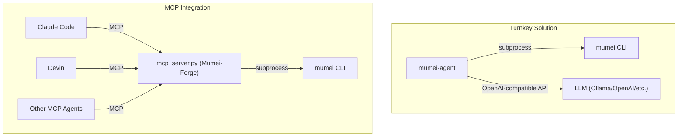

# Mumei Agent

AI-driven autonomous fix loop for the [Mumei](https://github.com/mumei-lang/mumei)
proof-driven programming language. Combines LLM (Qwen/Ollama/OpenAI) with Z3 formal
verification to automatically detect and fix code issues.

## Background

This repository was extracted from the [mumei](https://github.com/mumei-lang/mumei)
compiler repository. The self-healing agent and Streamlit visualizer were originally
developed in-tree and moved here as a standalone project
(see [mumei-lang/mumei#90](https://github.com/mumei-lang/mumei/pull/90)).

## Architecture

```
mumei CLI (Z3 verification)
  ^ subprocess: mumei check / mumei verify --json
  |
agent/self_healing.py (heal mode)     agent/generate.py (generate mode)
  ^ OpenAI-compatible API               ^ OpenAI-compatible API
  |                                      |
Ollama + Qwen (LLM inference)          Ollama + Qwen (LLM inference)
  ^ Docker Compose                       ^ Docker Compose
  |                                      |
docker-compose.yml                     docker-compose.yml
```

### Generate Flow

```
spec.json (atom specification)
  |
agent/generate.py (CLI entry point)
  |
agent/strategies/generate_strategy.py
  |  1. LLM generates .mm code from spec
  |  2. mumei check (parse validation)
  |  3. mumei verify --json (formal verification)
  |  4. If failed: LLM fixes code, goto 2
  |  5. Repeat up to max_retries
  |
output.mm (generated Mumei code, exit 0 if verified)
  |
mumei build output.mm --emit <target>
  Emitter Plugin Architecture により複数ターゲットへ出力可能:
    --emit llvm-ir   → LLVM IR (default, native binary)
    --emit c-header  → C header (.h) for FFI interop
  See: mumei docs/CROSS_PROJECT_ROADMAP.md "Emitter Plugin Architecture"
```

## Relationship with MCP Server / Other AI Agents

**mumei-agent** is a turnkey solution — it integrates LLM calls, `mumei verify`, and retry logic into a single autonomous fix loop. It invokes the mumei CLI directly via subprocess (no MCP required).

The [mumei](https://github.com/mumei-lang/mumei) compiler repository also ships an **MCP Server** (`mcp_server.py`, implemented as FastMCP("Mumei-Forge")), which allows any MCP-compatible AI agent (Claude Code, Devin, Codex, Qwen, etc.) to access mumei's verification capabilities directly over the Model Context Protocol.



### When to Use Which

- **mumei-agent**: Run `python -m agent file.mm` for a fully automated fix loop. LLM provider is configured via `.env` (Ollama, OpenAI, DashScope, etc.). Best when you want a single-command experience.
- **MCP Server**: Start `python mcp_server.py` in the [mumei repository](https://github.com/mumei-lang/mumei) and connect from any MCP-compatible agent. The agent calls tools like `validate_logic`, `forge_blade`, and `get_inferred_effects`, and uses its own LLM to decide how to fix issues. Best when you already use an MCP-capable agent and want to integrate mumei verification into your existing workflow.

Both approaches are **complementary** — choose based on your use case, or combine them as needed.

## Prerequisites

- [Mumei](https://github.com/mumei-lang/mumei) installed and available in PATH
  - Or: clone mumei repo and use `cargo run --` mode
- Docker (for Ollama)
- Python 3.10+

## Quick Start

```bash
# 1. Start Ollama container
docker compose up -d
docker exec mumei-ollama ollama pull qwen3.5

# 2. Configure environment
cp .env.example .env
# Edit .env to select your LLM provider (default: Ollama local)

# 3. Install dependencies
pip install -r requirements.txt

# 4. Run self-healing loop (uses examples/sword_test.mm by default)
python -m agent heal

# Or specify a file explicitly:
python -m agent heal examples/effect_test.mm

# 5. Generate new code from a specification
python -m agent generate --spec-file examples/spec.json --output out.mm

# 6. (Optional) Start Streamlit visualizer
streamlit run visualizer/app.py
```

## Examples

The `examples/` directory contains sample `.mm` files with known verification
failures for testing the self-healing loop:

| File | Violation Type | Description |
|---|---|---|
| `examples/sword_test.mm` | Precondition | Division without `b != 0` guard |
| `examples/effect_test.mm` | Effect mismatch | Uses `FileWrite` but only declares `[Log]` |

```bash
# Demo: precondition fix
python -m agent heal examples/sword_test.mm

# Demo: effect mismatch fix
python -m agent heal examples/effect_test.mm

# Backward compatible (no subcommand = heal mode)
python -m agent examples/sword_test.mm
```

## Generate Mode

The `generate` subcommand creates new Mumei code from a JSON specification.
It uses an LLM to generate code, then verifies it with `mumei check` and
`mumei verify --json`, auto-fixing any issues.

### Spec JSON Format

```json
{
  "name": "safe_read",
  "params": [{"name": "path", "type": "Str"}],
  "effects": ["SafeFileRead(path)"],
  "requires": "starts_with(path, \"/tmp/\") && not_contains(path, \"..\")",
  "ensures": "result >= 0",
  "description": "Read a file safely with path traversal prevention"
}
```

### Usage

```bash
# From a spec file
python -m agent generate --spec-file spec.json --output out.mm

# From inline JSON
python -m agent generate --spec '{"name": "add", "params": [{"name": "a", "type": "i64"}, {"name": "b", "type": "i64"}], "requires": "true", "ensures": "result == a + b"}' --output add.mm

# With metrics output
python -m agent generate --spec-file spec.json --output out.mm --metrics
```

### Metrics

Use the `--metrics` flag to output a JSON summary of generation/fix statistics:

```json
{
  "total_attempts": 3,
  "successes": 1,
  "by_violation_type": {
    "generation": {"attempts": 1, "successes": 1},
    "effect_mismatch": {"attempts": 2, "successes": 0}
  }
}
```

## E2E Demo

https://github.com/user-attachments/assets/908ae828-d249-4967-b9b0-55d56dd3d95e

The self-healing loop follows this interaction flow:

1. **Verification failure**: `mumei build` detects a precondition bug (missing `b != 0` guard)
2. **LLM fix**: The agent sends the Z3 counter-example to the LLM, which generates a corrected `requires` clause
3. **Re-verification**: `mumei build` confirms the fix passes formal verification

## LLM Provider Support

| Provider | Config Pattern | Cost |
|---|---|---|
| Ollama (local) | Pattern 1 | Free |
| External API (DashScope etc.) | Pattern 2 | Pay-per-use |
| vLLM (local) | Pattern 3 | Free |
| OpenAI | Pattern 4 | Pay-per-use |

See `.env.example` for configuration details.

## Subcommands

| Command | Description | Example |
|---|---|---|
| `heal` (default) | Self-healing loop for existing .mm files | `python -m agent heal examples/sword_test.mm` |
| `generate` | Generate new .mm code from spec JSON | `python -m agent generate --spec-file spec.json --output out.mm` |

## report.json Schema

This agent consumes the `report.json` output from `mumei verify --json`.
See [REPORT_SCHEMA.md](https://github.com/mumei-lang/mumei/blob/develop/docs/REPORT_SCHEMA.md)
for the full schema documentation.

## Roadmap

See [`docs/ROADMAP.md`](docs/ROADMAP.md) for the agent-specific roadmap, and
[mumei-lang/mumei `docs/CROSS_PROJECT_ROADMAP.md`](https://github.com/mumei-lang/mumei/blob/develop/docs/CROSS_PROJECT_ROADMAP.md)
for the cross-project roadmap covering both the compiler and agent.

## License

[Apache-2.0 license](LICENSE)
