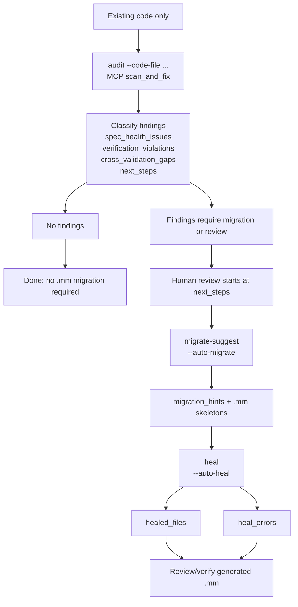

# Audit Contract Reference

## Cross-project harness vocabulary

`mumei-lang/mumei/docs/CROSS_PROJECT_ROADMAP.md` is the single top-level roadmap. Agent docs and MCP contracts use the same canonical field names: `harness_contract`, `intent_fidelity`, `artifact_paths`, `budget_policy_fingerprint`, and `lean_verified`. Audit/spec tooling additionally uses the stable audit keys `spec_health_issues`, `verification_violations`, `verification_status`, `cross_validation_gaps`, `next_steps`, `migration_hints`, `healed_files`, and `heal_errors`, plus `contradiction_type` values `spec_internal`, `spec_overconstraint`, `spec_vacuity`, and `spec_vs_code`; do not introduce aliases in README, CLI help, or MCP tool descriptions.

`uv run mumei-agent audit --code-file ... --auto-migrate --auto-heal` and MCP `scan_and_fix` are the same no-`.mm` contract: `audit` emits `spec_health_issues` / `verification_violations` / `verification_status` / `cross_validation_gaps` / `next_steps`, `migrate-suggest` emits `migration_hints`, and `heal` records `healed_files` / `heal_errors`.

## No-.mm entry: one audit contract

`uv run mumei-agent audit --code-file ... --auto-migrate --auto-heal` and MCP `scan_and_fix` are the same contract. They both run the same three-stage path:

1. `audit`: accept existing code only, extract candidate specs, and classify findings.
2. `migrate-suggest` / `--auto-migrate`: emit `.mm` skeleton guidance only for findings that need migration.
3. `heal` / `--auto-heal`: run self-healing on those generated skeletons and report the outcome.

Canonical result keys are fixed as follows:

Language support is split into two layers:

| Layer | Scope | Supported languages |
|-------|-------|---------------------|
| Layer A (spec extraction) | `extract-spec --code-file`, `extract_spec_from_code` MCP, LLM/regex-based NL spec extraction | `rust`, `c`, `cpp`, `go`, `python`, `javascript`, `typescript`, `java`, `solidity` |
| Layer B (Z3 strict verification) | `validate-code`, `validate-spec-to-code`, `validate-code-to-spec`, `audit`, `scan_and_fix` MCP | `python`, `rust`, `typescript`, `go`, `solidity` |

Layer A uses LLM and regex heuristics to extract natural-language specifications from code. Layer B uses Z3 SMT solver and deterministic foreign-code parsers for strict contract verification. Languages supported only by Layer A (c, cpp, java, javascript) can be used for spec extraction but will receive an informative error if passed to Layer B tools.

`audit`, `validate-code`, `validate-spec-to-code`, `validate-code-to-spec`, and MCP `scan_and_fix` use the same fixed keys for all five Layer B languages; Rust overflow/bounds findings, TypeScript null/undefined findings, Go bounds/nil/overflow findings, and Solidity `uint256`/`int256` overflow and array-bounds findings appear in `verification_violations` with Z3 counterexamples when the deterministic parser can prove an unsafe path. Solidity support covers function-level pre/postconditions and 256-bit overflow/bounds; Layer B also emits advisory heuristic warnings for reentrancy / Checks-Effects-Interactions and missing access control, backed by a guard-state-machine trace and suppressed when `nonReentrant`/manual-lock guards are present. The guard-trace certificate's access-control obligations stay `unknown` for verification purposes by default; `audit --enable-lean-bridge --mumei-lean-repo <path>` runs the optional mumei-lean bridge (`run_lean_bridge_and_merge_proof_cert`) that merges `lean_verified` results into the emitted proof certificate. The flag only applies to Solidity audits and is a no-op without `--mumei-lean-repo`; it is CLI-only today — MCP `scan_and_fix` does not expose it. LLM credentials are optional: when no key is configured, the deterministic parser still extracts signatures, safety preconditions, and postcondition candidates.

| Key | Meaning |
| --- | --- |
| `spec_health_issues` | Spec-only contradictions, overconstraints, vacuity, or ambiguity in extracted/provided specs; these do not require existing-code execution to be meaningful. |
| `verification_violations` | Existing-code bugs or unsafe paths found before `.mm` migration by checking inferred/extracted contracts against the source. |
| `verification_status` | Machine-readable code-safety verdict for the audited source: `verified`, `refuted`, or `unverifiable`. |
| `cross_validation_gaps` | Spec↔code mismatches: missing constraints, stronger/weaker behavior, or cross-spec drift that still needs migration or review. |
| `next_steps` | The human-review entrypoint: prioritized actions and commands reviewers should run before accepting migration or healing evidence. |
| `migration_hints` | `.mm` skeleton advice produced by `migrate-suggest` / `--auto-migrate` for functions attached to violations or gaps. |
| `healed_files` | Generated `.mm` skeleton files that the self-healing loop rewrote or accepted successfully. |
| `heal_errors` | Per-skeleton self-healing failures and diagnostics; these never change the meaning of the audit findings. |



Use the one-command CLI form when you want audit, skeleton generation, and healing evidence together:

```bash
uv run mumei-agent audit --code-file src/ --auto-migrate --auto-heal --heal-output-dir out/
```

MCP clients call the same contract with `scan_and_fix`:

```json
{
  "code_file": "src/",
  "language": "python",
  "auto_heal": true,
  "heal_output_dir": "out/"
}
```

`next_steps` is the only handoff into human review. Do not add aliases for `spec_health_issues`, `verification_violations`, `cross_validation_gaps`, `next_steps`, `migration_hints`, `healed_files`, or `heal_errors`; downstream docs, MCP responses, and demo JSON should consume those names exactly.

Within `spec_health_issues`, entries prefixed `domain-completeness:` come from the domain checklist that runs when `audit --domain-hint <d>` (or `validate-spec --domain`/`--domain-hint`) is used — e.g. `domain-completeness: financial spec lacks balance conservation (…; expected in ensures)`. They follow the same prefix convention as `contradiction:` / `over-constrained:` / `vacuous:` / `encoding-gap:` and are findings, not a new output key. Similarly, `validate-code` issues carry a `fix_suggestion` field inside each existing violation object — a heuristic text hint per finding kind, never an applied edit. When the violation has a usable `source_line` and the message names the offending expression, the hint appends a `Suggested diff` fenced block showing the contract/guard line to add above the flagged signature (`requires: <condition>` contract comments for bounds/division/overflow/dereference kinds, `nonReentrant` / `require(msg.sender == owner, …)` edits for the Solidity advisory kinds); otherwise the field holds the text hint alone. The domain completeness check also runs for `extract-spec --domain <d>` (warnings on stderr) and MCP `extract_spec_from_code` with `domain_hint` (appended to the file-mode `warnings` list) — no new output keys in either path.

Language-pattern advisories (V1-B-2, `agent/language_patterns.py`) add heuristic "common problem" findings — e.g. Python mutable default arguments, Rust unguarded `unwrap()`, Go `defer` inside loops, TypeScript floating promises, Solidity `tx.origin`/`selfdestruct`/unchecked low-level `call`/`delegatecall`/`send`/`staticcall`. They surface only on the warnings side: `verify` reports them inside `warnings`, and `validate-code` emits them as `severity="warning"` `verification` issues (demoted to `warnings` on `verified` results, with phrase-routed `fix_suggestion` hints). They never land in `errors`, so they cannot flip `success` on their own. `audit` does not emit them today — its output vocabulary is fixed and every findings channel (`verification_violations`, `spec_health_issues`, `cross_validation_gaps`) blocks `success`.

For manual review, run the same stages separately:

```bash
uv run mumei-agent audit --code-file src/foo.py --language python
uv run mumei-agent migrate-suggest --code-file src/foo.py --language python --output generated/mm
uv run mumei-agent heal generated/mm/foo.mm
```

Demo wording for no-`.mm` user-facing material is fixed to these three phrases:

1. 既存コードを渡すだけでバグ箇所を指摘
2. 仕様から既存コードとの差分を指摘
3. 仕様単独でおかしい場合を指摘
