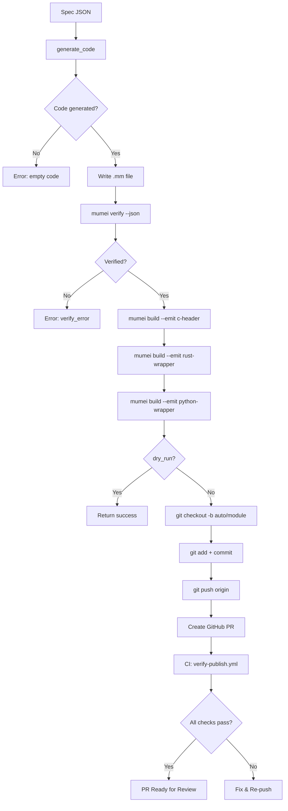

# Autonomous Delivery Pipeline (SI-3)

> mumei-agent の `--publish` モードによる自律デリバリーパイプライン。  
> 仕様 JSON → 検証済みコード生成 → FFI ラッパー自動生成 → Git commit → PR 作成を完全自動化。

## パイプライン全体フロー



## 使い方

### Dry-run（Git/PR 操作なし）

```bash
python -m agent publish --spec <path-to-spec.json> --dry-run
```

### フルパイプライン

```bash
python -m agent publish \
  --spec examples/publish_demo/payment_spec.json \
  --github-owner mumei-lang \
  --github-repo mumei-agent \
  --base-branch develop
```

### コマンドラインオプション

| オプション | デフォルト | 説明 |
|-----------|-----------|------|
| `--spec` | (必須) | Spec JSON ファイルのパス |
| `--mumei-bin` | `MUMEI_BIN` env or `mumei` | mumei バイナリのパスまたはコマンド |
| `--output` | `katana` | ビルドアーティファクトの出力ディレクトリ |
| `--repo-dir` | カレントディレクトリ | Git 操作のワーキングディレクトリ |
| `--base-branch` | `develop` | PR のベースブランチ |
| `--github-owner` | `GITHUB_OWNER` env | GitHub リポジトリオーナー |
| `--github-repo` | `GITHUB_REPO` env | GitHub リポジトリ名 |
| `--dry-run` | `false` | Git 操作と PR 作成をスキップ |

## 環境変数

| 変数名 | 必須 | 説明 |
|--------|------|------|
| `MUMEI_BIN` | No | mumei バイナリのパス（`--mumei-bin` で上書き可） |
| `OPENAI_API_KEY` | Yes | OpenAI API キー（コード生成に使用） |
| `GITHUB_TOKEN` | PR作成時 | GitHub API トークン（PR 作成に使用） |
| `GITHUB_OWNER` | PR作成時 | GitHub リポジトリオーナー |
| `GITHUB_REPO` | PR作成時 | GitHub リポジトリ名 |
| `LLM_API_KEY` | No | `OPENAI_API_KEY` の代替 |
| `LLM_BASE_URL` | No | OpenAI 互換 API のベース URL |
| `LLM_MODEL` | No | 使用する LLM モデル（デフォルト: `gpt-4o`） |

## CI 連携

### verify-publish.yml（自動 PR 検証）

PR に `.mm` ファイルが含まれる場合、以下の検証が自動実行されます:


1. **ファイル検出**: `git diff` で PR 内の `.mm` ファイルを検出
2. **検証**: `mumei verify --json` で各ファイルを検証
3. **C ヘッダー生成**: `--emit c-header` で `.h` ファイルを生成
4. **Rust ラッパー生成**: `--emit rust-wrapper` で `.rs` ファイルを生成 + `rustc` でコンパイル検証
5. **Python ラッパー生成**: `--emit python-wrapper` で `.py` ファイルを生成 + `ast.parse` で構文検証
6. **PR コメント**: 結果を PR コメントとして自動投稿

### mumei-verify.yml（再利用可能ワークフロー）

`workflow_call` として他のワークフローから呼び出し可能:

```yaml
jobs:
  verify:
    uses: ./.github/workflows/mumei-verify.yml
    with:
      files: "path/to/file.mm"
      proof-cert: true
```

### verify-examples.yml

`examples/*.mm` の変更時に自動検証を実行。publish パイプラインの dry-run テストも含みます。

## FFI Glue Code の説明

`--emit` ターゲットが生成するのは **FFI glue code**（FFI 結合コード）であり、トランスパイル結果ではありません。

### c-header（`.h` ファイル）

mumei の検証済み atom を C 関数として宣言するヘッダーファイル:

```c
#ifndef MODULE_H
#define MODULE_H
#include <stdint.h>

/** @pre a >= 0 && b >= 0
 *  @post result == a + b
 */
int64_t safe_add(int64_t a, int64_t b);

#endif
```

- `#ifndef` インクルードガード
- `@pre`/`@post` で契約を Doxygen 形式でドキュメント化
- `stdint.h` の固定幅整数型を使用

### rust-wrapper（`.rs` ファイル）

Rust の `extern "C"` ブロックで FFI 関数を宣言し、安全なラッパーを提供:

```rust
extern "C" {
    fn safe_add(a: i64, b: i64) -> i64;
}

pub fn safe_add_checked(a: i64, b: i64) -> Option<i64> {
    if a >= 0 && b >= 0 {
        Some(unsafe { safe_add(a, b) })
    } else {
        None
    }
}
```

- `extern "C"` ブロックで生の FFI 関数を宣言
- `_checked` サフィックスの安全ラッパーが契約を実行時に検証
- `Option<T>` で契約違反時の安全な失敗を表現

### python-wrapper（`.py` ファイル）

`ctypes` を使用して共有ライブラリを読み込み、Python 関数として公開:

```python
import ctypes

_lib = ctypes.CDLL("libmodule.so")
_lib.safe_add.argtypes = [ctypes.c_int64, ctypes.c_int64]
_lib.safe_add.restype = ctypes.c_int64

def safe_add(a: int, b: int) -> int:
    """requires: a >= 0 && b >= 0
    ensures: result == a + b"""
    return _lib.safe_add(a, b)
```

- `ctypes.CDLL` で共有ライブラリを読み込み
- `argtypes`/`restype` で型安全性を確保
- docstring に契約情報を記載

## パイプラインのステップ詳細

| ステップ | ツール | 説明 |
|---------|--------|------|
| 1. Spec 読み込み | Python | JSON spec をロード・バリデーション |
| 2. コード生成 | LLM + mumei-agent | Spec → mumei コード（contracts 付き） |
| 3. 検証 | `mumei verify --json` | Z3 で requires/ensures を証明 |
| 4. C ヘッダー生成 | `mumei build --emit c-header` | `.h` FFI ヘッダーを生成 |
| 5. Rust ラッパー生成 | `mumei build --emit rust-wrapper` | Rust extern バインディングを生成 |
| 6. Python ラッパー生成 | `mumei build --emit python-wrapper` | ctypes ラッパーを生成 |
| 7. Git 操作 | `git checkout/add/commit/push` | `auto/<module>` ブランチにコミット |
| 8. PR 作成 | GitHub API | ベースブランチに対して PR を作成 |
| 9. CI 検証 | `verify-publish.yml` | 自動検証 + PR コメント |

## Related Documents

- [`examples/publish_demo/README.md`](../examples/publish_demo/README.md) — Payment module デモ
- [`docs/ROADMAP.md`](ROADMAP.md) — mumei-agent ロードマップ
- [mumei-lang/mumei `docs/CROSS_PROJECT_ROADMAP.md`](https://github.com/mumei-lang/mumei/blob/develop/docs/CROSS_PROJECT_ROADMAP.md) — クロスプロジェクトロードマップ
