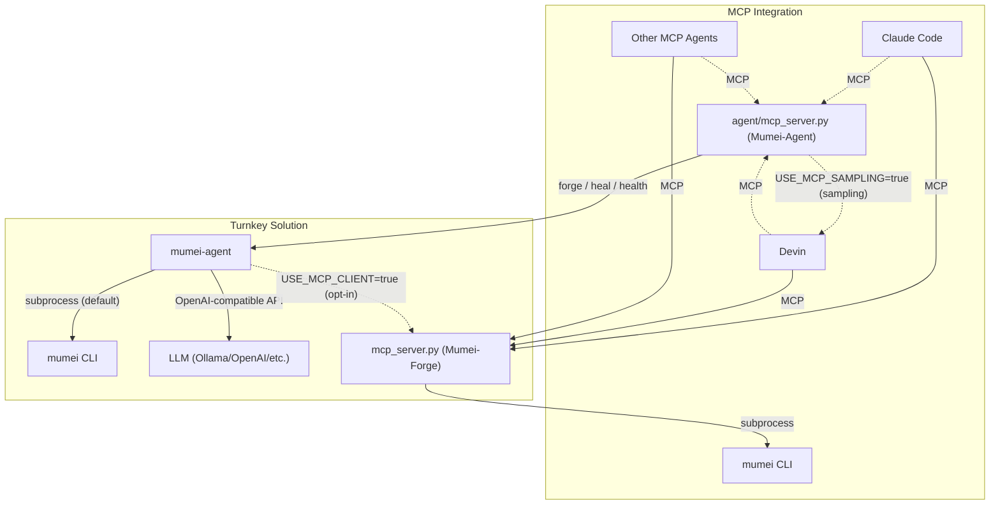

# MCP Server Reference

> Canonical cross-server contract: [mumei `docs/MCP_TOOL_CONTRACT.md`](https://github.com/mumei-lang/mumei/blob/develop/docs/MCP_TOOL_CONTRACT.md) is authoritative for both MCP servers. This document is subordinate to that contract and provides the agent-server detail.

## Relationship with MCP Server / Other AI Agents

**mumei-agent** is a turnkey solution — it integrates LLM calls, `mumei verify`, and retry logic into a single autonomous fix loop. It invokes the mumei CLI directly via subprocess (no MCP required).

The [mumei](https://github.com/mumei-lang/mumei) compiler repository also ships an **MCP Server** (`mcp_server.py`, implemented as FastMCP("Mumei-Forge")), which allows any MCP-compatible AI agent (Claude Code, Devin, Codex, Qwen, etc.) to access mumei's verification capabilities directly over the Model Context Protocol. The agent MCP server complements that with proof-friendly specification guidance so clients can request decidable-fragment hints before generating contracts.



By default, `agent/mcp_server.py` uses the same OpenAI-compatible LLM endpoint
as the CLI. Set `USE_MCP_SAMPLING=true` to make all LLM-backed MCP tools request
completion through standard MCP sampling from the connected client instead, so
Devin or another MCP client supplies the LLM role without `LLM_API_KEY` being
configured in mumei-agent. If the client does not support sampling, or sampling
fails, the agent falls back to the OpenAI-compatible path.

See [`docs/AGENT_HARNESS_SPEC.md`](./AGENT_HARNESS_SPEC.md) § *MCP sampling
provider* for the sampling-capable tool list, the MCP 2025-11-25 spec mapping,
and capability-detection details. The `mumei/mcp_server.py` **Mumei-Forge**
server remains verification-only; sampling is implemented only in `mumei-agent`
so the forge/heal loop is not duplicated in the compiler repository.

### When to Use Which

- **mumei-agent**: Run `uv run mumei-agent file.mm` for a fully automated fix loop. LLM provider is configured via `.env` (Ollama, OpenAI, DashScope, etc.). Best when you want a single-command experience.
- **MCP Server**: Start `python mcp_server.py` in the [mumei repository](https://github.com/mumei-lang/mumei) and connect from any MCP-compatible agent. The agent calls tools like `validate_logic`, `forge_blade`, and `get_inferred_effects`, and uses its own LLM to decide how to fix issues. Best when you already use an MCP-capable agent and want to integrate mumei verification into your existing workflow.

Both approaches are **complementary** — choose based on your use case, or combine them as needed.

## MCP Server

`uv run mumei-agent mcp-server` runs mumei-agent as a `FastMCP("Mumei-Agent")`
server over stdio.  Any MCP-compatible client (Claude Code, Devin,
Codex, ...) can drive the same forge loop that the CLI exposes.

Exported tools:

| Tool | Arguments | Documented return keys |
| --- | --- | --- |
| `get_spec_guide_summary` |  |  |
| `get_spec_guidelines` |  |  |
| `forge_task` | `task_json: str, mumei_repo: str, dry_run: bool = True, ctx: Context \| None = None` | `task_id`, `status`, `target_file`, `error`, `code_length` |
| `heal_file` | `source_code: str = '', error_report: str = '', code_file: str = '', ctx: Context \| None = None` | `healed_code`, `attempts`, `success`, `error` |
| `self_correct` | `code_file: str, max_iterations: int = 10, ctx: Context \| None = None` |  |
| `run_nlae_pipeline` | `spec: str, mumei_lean_repo: str = '', work_dir: str = '', no_build: bool = False, multi_agent: bool = False` |  |
| `measure_std_health` | `mumei_repo: str` | `total_files`, `verified_files`, `failed_files`, `total_atoms`, `verified_atoms`, `trusted_atoms`, `health_score`, `todo_count`, `details` |
| `cross_validate` | `spec_file: str, impl_file: str, language: str = ''` | `spec_stronger_than_impl`, `impl_stronger_than_spec`, `uncovered_atoms`, `coverage_ratio`, `details` |
| `propose_forge_tasks` | `mumei_repo: str, max_proposals: int = 3` | `proposals`, `specs` |
| `list_forge_log` | `log_path: str = 'forge_log.json'` | `entries`, `count` |
| `get_review_queue` | `mumei_repo: str` |  |
| `approve_review` | `atom_name: str, reviewer: str, notes: str` |  |
| `escalate_to_lean` | `atom_name: str` |  |
| `reject_review` | `atom_name: str, reviewer: str, notes: str` |  |
| `get_agent_status` |  |  |
| `send_latent_message` | `message: str, context: str = '{}', verify: bool = True` |  |
| `send_latent_message_batch` | `messages: str, verify: bool = False` |  |
| `async_send_latent_message` | `message: str, context: str = '{}', verify: bool = True` |  |
| `extract_spec` | `natural_language: str, domain_hint: str = '', generate: bool = False, mumei_repo: str = '', check_contradiction_only: bool = False, ctx: Context \| None = None` | `spec`, `code`, `verified` |
| `check_spec_contradiction` | `natural_language: str, domain_hint: str = '', ctx: Context \| None = None` |  |
| `check_cross_spec_consistency` | `spec_files: str` |  |
| `check_spec_health` | `source_code: str, mumei_repo: str = ''` | `contradictions`, `over_constrained`, `vacuous`, `health_score` |
| `validate_nl_spec` | `spec_text: str, use_llm: bool = True, run_mumei: bool = True, domain_hint: str = '', ctx: Context \| None = None` |  |
| `validate_nl_spec_multi` | `spec_texts_json: str, domain_hint: str = '', use_llm: bool = True, ctx: Context \| None = None` |  |
| `validate_code` | `code: str, language: str, use_llm: bool = True, run_mumei: bool = True, ctx: Context \| None = None` |  |
| `validate_foreign_code` | `code: str, language: str, use_llm: bool = True, run_mumei: bool = True, ctx: Context \| None = None` |  |
| `validate_spec_to_code` | `spec: str, code_path: str, language: str \| None = None, use_llm: bool = True, run_mumei: bool = True, ctx: Context \| None = None` |  |
| `validate_code_to_spec` | `code_path: str, spec_path: str, language: str \| None = None, use_llm: bool = True, run_mumei: bool = True, ctx: Context \| None = None` |  |
| `verify_conformance` | `spec: str, code_path: str, language: str \| None = None, use_llm: bool = True, run_mumei: bool = True, ctx: Context \| None = None` |  |
| `verify_code_spec_traceability` | `code_file: str, spec_text: str, language: str \| None = None, use_llm: bool = True, run_mumei: bool = True, ctx: Context \| None = None` |  |
| `verify_foreign_code` | `source_code: str, language: str, use_llm: bool = True, run_mumei: bool = True, ctx: Context \| None = None` |  |
| `audit_code` | `source_code: str, language: str, domain_hint: str = '', ctx: Context \| None = None` |  |
| `suggest_mm_migration` | `code_file: str, language: str, issues_json: str = '[]'` | `migration_hints` |
| `scan_and_fix` | `code_file: str, language: str, spec: str = '', auto_heal: bool = False, heal_output_dir: str = '', domain_hint: str = '', output_format: str = 'json', ctx: Context \| None = None` | `spec_health_issues`, `verification_violations`, `verification_status`, `cross_validation_gaps`, `next_steps`, `migration_hints`, `healed_files`, `heal_errors` |
| `extract_spec_from_code` | `code_file: str, language: str = '', domain_hint: str = '', generate: bool = False, mumei_repo: str = '', ctx: Context \| None = None` | `spec`, `natural_language_spec`, `detected_language`, `warnings`, `code`, `final_spec`, `verified` |

`check_cross_spec_consistency` delegates to `mumei verify --cross-spec-files` and returns the parsed `cross_spec.json`, including contract consistency, global invariant conflicts, source file names, and dependency cycles.

Example `.mcp.json` snippet for Claude Code project MCP config:

```json
{
  "mcpServers": {
    "mumei-forge": {
      "command": "sh",
      "args": ["-lc", "cd ../mumei && exec python mcp_server.py"]
    },
    "mumei-agent": {
      "command": "sh",
      "args": ["-lc", "cd . && exec uv run mumei-agent mcp-server"]
    }
  }
}
```

The committed `.mcp.json` assumes the mumei compiler repository is checked out
as a sibling directory (`../mumei`).  Adjust that path if your workspace layout
differs.  The config intentionally uses `sh -lc "cd ... && exec ..."` instead
of a `cwd` field because Claude Code project MCP configs are most portable when
the working directory is set by the command itself.

### Proof-friendly specification guidance

`get_spec_guidelines()` exposes the same decidable-fragment guidance injected into generation prompts: prefer linear arithmetic, bounded array/sequence access, bounded quantifiers, and explicit finite temporal states. When a spec triggers `outside_decidable_fragment`, callers should simplify the contract, add explicit bounds or witnesses, or route the obligation to Lean.

P8-C metrics in `agent.metrics.Metrics` track how often new specifications fall outside the decidable fragment (`outside_decidable_fragment_warnings`, `z3_unknowns`, `first_pass_verification_success_rate`, and `by_logic_fragment`) so the guidance can be refreshed quarterly.

### Lean fallback diagnostics

Set `MUMEI_LEAN_REPO=/path/to/mumei-lean` to let `proliferate` escalate
`z3_check_result == "unknown"` atoms through the Lean bridge. The fallback contract matches `mumei-lean`: live-generated theorem path `Generated.Std.Math.Abs.abs_saturating_correct`, known-witness fallback `MumeiLean.StdMathAbs`, and stable failure classes `lake_missing`, `partial_translation`, and `stale_translator`. The fallback now
records retryability, per-error-code failure rates, proof-time distribution, and
partial-success status in the summary JSON. See
[`docs/LEAN_FALLBACK.md`](./LEAN_FALLBACK.md) for error-code meanings and
troubleshooting steps.

### MCP-backed verification (opt-in)

Set `USE_MCP_CLIENT=true` to make forge / heal / proliferate route their
verification through `agent.mcp_client.MumeiMCPClient` instead of the
raw `mumei verify --json` subprocess.  The MCP client returns the
richer semantic feedback the mumei MCP server formats (`semantic_feedback`,
`machine_readable`, `counter_example`, `effect_violation`).  Any failure
falls back to the subprocess client so the agent always works.

The client picks a transport automatically:

- **In-process** when the mumei repo is on `PYTHONPATH` (default in CI).
- **stdio subprocess** when `MUMEI_MCP_COMMAND` is set
  (e.g. `MUMEI_MCP_COMMAND="python /path/to/mumei/mcp_server.py"`).

### Unified gap analysis (`PREFER_MCP_GAPS`)

`agent/gap_rules.py` is the offline copy of the gap-rule logic from the
mumei MCP server's `analyze_std_gaps` tool.  Set `PREFER_MCP_GAPS=true`
(and put the mumei repo on `PYTHONPATH`) to make
`agent.proliferate.analyze_gaps` delegate to the authoritative
implementation in the mumei repo.  `proliferate.yml` already does this
in CI so the rule set is always in lockstep with whatever ships in
mumei.
