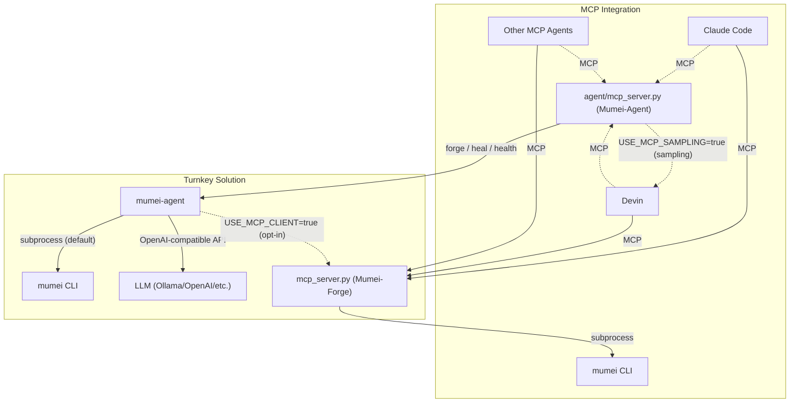

# MCP Server Reference

## Relationship with MCP Server / Other AI Agents

**mumei-agent** is a turnkey solution — it integrates LLM calls, `mumei verify`, and retry logic into a single autonomous fix loop. It invokes the mumei CLI directly via subprocess (no MCP required).

The [mumei](https://github.com/mumei-lang/mumei) compiler repository also ships an **MCP Server** (`mcp_server.py`, implemented as FastMCP("Mumei-Forge")), which allows any MCP-compatible AI agent (Claude Code, Devin, Codex, Qwen, etc.) to access mumei's verification capabilities directly over the Model Context Protocol. The agent MCP server complements that with proof-friendly specification guidance so clients can request decidable-fragment hints before generating contracts.



By default, `agent/mcp_server.py` uses the same OpenAI-compatible LLM endpoint
as the CLI. Set `USE_MCP_SAMPLING=true` to make all LLM-backed MCP tools request
completion through standard MCP sampling from the connected client instead, so
Devin or another MCP client supplies the LLM role without `LLM_API_KEY` being
configured in mumei-agent. If the client does not support sampling, or sampling
fails, the agent falls back to the OpenAI-compatible path.

See [`docs/AGENT_HARNESS_SPEC.md`](./AGENT_HARNESS_SPEC.md) § *MCP sampling
provider* for the sampling-capable tool list, the MCP 2025-11-25 spec mapping,
and capability-detection details. The `mumei/mcp_server.py` **Mumei-Forge**
server remains verification-only; sampling is implemented only in `mumei-agent`
so the forge/heal loop is not duplicated in the compiler repository.

### When to Use Which

- **mumei-agent**: Run `uv run mumei-agent file.mm` for a fully automated fix loop. LLM provider is configured via `.env` (Ollama, OpenAI, DashScope, etc.). Best when you want a single-command experience.
- **MCP Server**: Start `python mcp_server.py` in the [mumei repository](https://github.com/mumei-lang/mumei) and connect from any MCP-compatible agent. The agent calls tools like `validate_logic`, `forge_blade`, and `get_inferred_effects`, and uses its own LLM to decide how to fix issues. Best when you already use an MCP-capable agent and want to integrate mumei verification into your existing workflow.

Both approaches are **complementary** — choose based on your use case, or combine them as needed.

## MCP Server

`uv run mumei-agent mcp-server` runs mumei-agent as a `FastMCP("Mumei-Agent")`
server over stdio.  Any MCP-compatible client (Claude Code, Devin,
Codex, ...) can drive the same forge loop that the CLI exposes.

Exported tools:

| Tool | Description |
|---|---|
| `approve_review(atom_name, reviewer, notes)` | Record human approval for one atom in the active review queue; requires `get_review_queue` first, fails if the atom is `REJECTED` or `ESCALATED_TO_LEAN` |
| `async_send_latent_message(message, context='{}', verify=true)` | Asynchronously send a single latent message through one protocol instance |
| `audit_code(source_code, language, domain_hint='')` | Audit existing code: extract spec, verify contracts, detect cross-validation gaps |
| `check_cross_spec_consistency(spec_files)` | Run cross-spec verification for a JSON array or comma-separated list of `.mm` files and return cross-validation evidence |
| `check_spec_contradiction(natural_language, domain_hint='')` | Extract a natural-language spec and return `contradiction_type=spec_internal` for direct contradictions without code generation |
| `check_spec_health(source_code, mumei_repo='')` | Check a Mumei spec for contradictions, over-constraints, and vacuity |
| `cross_validate(spec_file, impl_file, language='')` | Cross-validate a Mumei spec (.mm) against its implementation code |
| `escalate_to_lean(atom_name)` | Run `mumei verify --escalate-lean` and mark an atom as escalated; requires `get_review_queue` first, fails if the atom is `APPROVED` or `REJECTED` |
| `extract_spec(natural_language, domain_hint='', generate=false, mumei_repo='', check_contradiction_only=false)` | Extract a forge spec, optionally generate code, or run contradiction-only validation |
| `extract_spec_from_code(code_file, language='', domain_hint='', generate=false, mumei_repo='')` | Extract natural-language specification from existing code (Layer A) |
| `forge_task(task_json, mumei_repo, dry_run=true)` | Run a single forge spec (drop-in `MumeiForge.forge_one`) |
| `get_agent_status()` | Report LLM provider, mumei binary, available subcommands, and registered MCP tools |
| `get_review_queue(mumei_repo)` | Return the human review queue emitted by `mumei verify` and set the active tracker for `approve_review` / `reject_review` / `escalate_to_lean` |
| `get_spec_guide_summary()` | Return the agent-facing decidable-fragment guideline summary |
| `get_spec_guidelines()` | Return proof-friendly generation guidance for the Z3-stable decidable fragment and Lean escalation candidates |
| `heal_file(source_code='', error_report='', code_file='')` | Self-heal a `.mm` source via the existing fix-strategy pipeline |
| `list_forge_log(log_path='forge_log.json')` | Read `forge_log.json` |
| `measure_std_health(mumei_repo)` | Delegate to `agent.std_health.measure_health` |
| `propose_forge_tasks(mumei_repo, max_proposals=3)` | MCP-accessible `uv run mumei-agent propose --auto` |
| `reject_review(atom_name, reviewer, notes)` | Record human rejection for one atom in the active review queue; requires `get_review_queue` first, fails if the atom is `ESCALATED_TO_LEAN` |
| `run_nlae_pipeline(spec, mumei_lean_repo='', work_dir='', no_build=false)` | Run the P9-G NLAE pipeline: generate `.mm`, verify with `--emit loss-vector`, self-correct, then call the Lean Fidelity Checker |
| `scan_and_fix(code_file, language, spec='', auto_heal=false, heal_output_dir='', domain_hint='', output_format='json')` | Same contract as `audit --code-file ... --auto-migrate --auto-heal`: audit a file/directory, return `cross_validation_gaps`, emit `migration_hints`, optionally self-heal |
| `self_correct(code_file, max_iterations=10)` | Run the P9-F Loss Vector self-correction loop for a `.mm` file |
| `send_latent_message(message, context='{}', verify=true)` | Send a single latent message through one protocol instance |
| `send_latent_message_batch(messages, verify=false)` | Send multiple latent messages through one protocol instance |
| `suggest_mm_migration(code_file, language, issues_json='[]')` | Generate `.mm` migration skeleton for functions with verification issues |
| `validate_code(code, language, use_llm=true, run_mumei=true)` | Infer and verify contracts from existing code (Layer B: Python, Rust, TypeScript, Go) |
| `validate_code_to_spec(code_path, spec_path, language=None, use_llm=true, run_mumei=true)` | Detect spec drift by comparing changed code to spec |
| `validate_foreign_code(code, language, use_llm=true, run_mumei=true)` | Infer and verify contracts from foreign code (alias for `validate_code`) |
| `validate_nl_spec(spec_text, use_llm=true, run_mumei=true, domain_hint='')` | Validate a natural-language spec for contradictions, ambiguity, and over-constraint |
| `validate_nl_spec_multi(spec_texts_json, domain_hint='', use_llm=true)` | Validate multiple natural-language specs in one call |
| `validate_spec_to_code(spec, code_path, language=None, use_llm=true, run_mumei=true)` | Detect missing implementation constraints by comparing spec to code |
| `verify_code_spec_traceability(code_file, spec_text, language=None, use_llm=true, run_mumei=true)` | Return the V1-C/V1-D bidirectional traceability summary with `cross_validation_gaps`, `drift_score`, and `next_steps` |
| `verify_conformance(spec, code_path, language=None, use_llm=true, run_mumei=true)` | Return the V1-C conformance JSON with `next_steps` and no review aliases |
| `verify_foreign_code(source_code, language, use_llm=true, run_mumei=true)` | Z3 strict verification of foreign code contracts |

`check_cross_spec_consistency` delegates to `mumei verify --cross-spec-files` and returns the parsed `cross_spec.json`, including contract consistency, global invariant conflicts, source file names, and dependency cycles.

Example `.mcp.json` snippet for Claude Code project MCP config:

```json
{
  "mcpServers": {
    "mumei-forge": {
      "command": "sh",
      "args": ["-lc", "cd ../mumei && exec python mcp_server.py"]
    },
    "mumei-agent": {
      "command": "sh",
      "args": ["-lc", "cd . && exec uv run mumei-agent mcp-server"]
    }
  }
}
```

The committed `.mcp.json` assumes the mumei compiler repository is checked out
as a sibling directory (`../mumei`).  Adjust that path if your workspace layout
differs.  The config intentionally uses `sh -lc "cd ... && exec ..."` instead
of a `cwd` field because Claude Code project MCP configs are most portable when
the working directory is set by the command itself.

### Proof-friendly specification guidance

`get_spec_guidelines()` exposes the same decidable-fragment guidance injected into generation prompts: prefer linear arithmetic, bounded array/sequence access, bounded quantifiers, and explicit finite temporal states. When a spec triggers `outside_decidable_fragment`, callers should simplify the contract, add explicit bounds or witnesses, or route the obligation to Lean.

P8-C metrics in `agent.metrics.Metrics` track how often new specifications fall outside the decidable fragment (`outside_decidable_fragment_warnings`, `z3_unknowns`, `first_pass_verification_success_rate`, and `by_logic_fragment`) so the guidance can be refreshed quarterly.

### Lean fallback diagnostics

Set `MUMEI_LEAN_REPO=/path/to/mumei-lean` to let `proliferate` escalate
`z3_check_result == "unknown"` atoms through the Lean bridge. The fallback contract matches `mumei-lean`: live-generated theorem path `Generated.Std.Math.Abs.abs_saturating_correct`, known-witness fallback `MumeiLean.StdMathAbs`, and stable failure classes `lake_missing`, `partial_translation`, and `stale_translator`. The fallback now
records retryability, per-error-code failure rates, proof-time distribution, and
partial-success status in the summary JSON. See
[`docs/LEAN_FALLBACK.md`](./LEAN_FALLBACK.md) for error-code meanings and
troubleshooting steps.

### MCP-backed verification (opt-in)

Set `USE_MCP_CLIENT=true` to make forge / heal / proliferate route their
verification through `agent.mcp_client.MumeiMCPClient` instead of the
raw `mumei verify --json` subprocess.  The MCP client returns the
richer semantic feedback the mumei MCP server formats (`semantic_feedback`,
`machine_readable`, `counter_example`, `effect_violation`).  Any failure
falls back to the subprocess client so the agent always works.

The client picks a transport automatically:

- **In-process** when the mumei repo is on `PYTHONPATH` (default in CI).
- **stdio subprocess** when `MUMEI_MCP_COMMAND` is set
  (e.g. `MUMEI_MCP_COMMAND="python /path/to/mumei/mcp_server.py"`).

### Unified gap analysis (`PREFER_MCP_GAPS`)

`agent/gap_rules.py` is the offline copy of the gap-rule logic from the
mumei MCP server's `analyze_std_gaps` tool.  Set `PREFER_MCP_GAPS=true`
(and put the mumei repo on `PYTHONPATH`) to make
`agent.proliferate.analyze_gaps` delegate to the authoritative
implementation in the mumei repo.  `proliferate.yml` already does this
in CI so the rule set is always in lockstep with whatever ships in
mumei.
