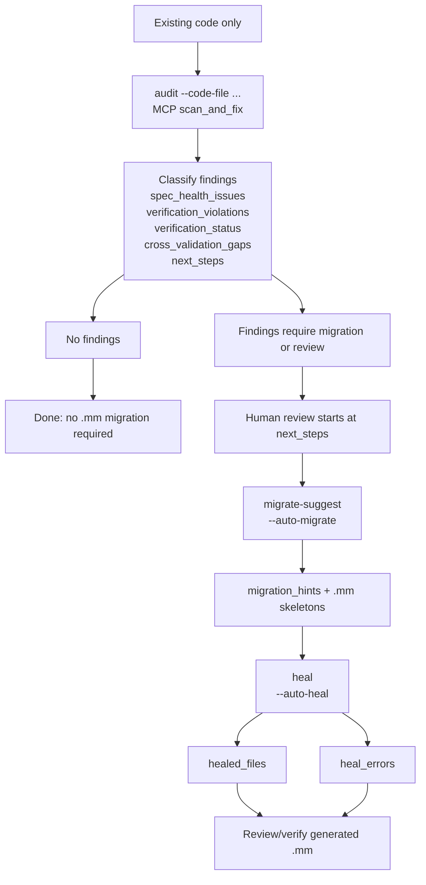

# 検証ワークフローガイド

> Cross-project contract: `mumei-lang/mumei/docs/CROSS_PROJECT_ROADMAP.md` is the only top-level roadmap. This guide uses the canonical vocabulary `harness_contract`, `intent_fidelity`, `artifact_paths`, `budget_policy_fingerprint`, `lean_verified`, plus agent audit keys `spec_health_issues`, `verification_violations`, `verification_status`, `cross_validation_gaps`, `next_steps`, `migration_hints`, `healed_files`, `heal_errors`, and `contradiction_type`.

## 配布物の proof artifact 検証

mumei の release / Homebrew 配布物には、標準ライブラリの module ごとの
proof certificate（`std/certs/`）と、それらをまとめた proof bundle が同梱されます。
配布物だけを別環境で検査する場合は、同梱された source と certificate に対して
`mumei verify-cert --strict` を再実行してください。certificate と bundle の場所は
既存の `MUMEI_PROOF_CERTS` と `MUMEI_PROOF_BUNDLE` で指定できます。

bundle が返す証明成果物のパスは既存の `artifact_paths` key に記録されます。
この key を使って per-module certificate と bundle を収集・比較し、新しい
artifact key や alias を作らないでください。`lean_verified` provenance を使う
consumer は、bundle の `lean_provenance` と certificate の整合性を確認した上で、
必要な acceptance path に限り `--allow-lean-verified` を明示します。


## 0. No-.mm entry: one audit contract

`uv run mumei-agent audit --code-file ... --auto-migrate --auto-heal` and MCP `scan_and_fix` are the same contract. They both run the same three-stage path:

1. `audit`: accept existing code only, extract candidate specs, and classify findings.
2. `migrate-suggest` / `--auto-migrate`: emit `.mm` skeleton guidance only for findings that need migration.
3. `heal` / `--auto-heal`: run self-healing on those generated skeletons and report the outcome.

Canonical result keys are fixed as follows:

Supported no-`.mm` source languages are Python, Rust, TypeScript, Go, and Solidity. The language changes only the parser path; `audit`, `validate-code`, and MCP `scan_and_fix` still return `spec_health_issues`, `verification_violations`, `verification_status`, `cross_validation_gaps`, `next_steps`, `migration_hints`, `healed_files`, and `heal_errors` without aliases. In deterministic/no-LLM mode, Rust overflow/bounds, TypeScript null/undefined, Go bounds/nil/overflow, and Solidity reentrancy/CEI/access-control fixtures are handled by the parser and Z3 counterexample path.

The cross-project reference demo is `mumei-demo/scenarios/no_mm_audit` (Phase 7 front door). Run `CI_FIXTURE_MODE=1 make demo-no-mm` there to see Python negative balance, Rust `a + b` i64 overflow, TypeScript `name!.length` null/undefined, and Go `values[idx]` bounds / `user.Name` nil / `a + b` overflow produce `verification_violations` with `next_steps` as the only human-review entrypoint. The demo stops at `audit -> migrate-suggest -> heal` before Lean escalation, so it does not expect `lean_verified`.

| Key | Meaning |
| --- | --- |
| `spec_health_issues` | Spec-only contradictions, overconstraints, vacuity, or ambiguity in extracted/provided specs; these do not require existing-code execution to be meaningful. |
| `verification_violations` | Existing-code bugs or unsafe paths found before `.mm` migration by checking inferred/extracted contracts against the source. |
| `verification_status` | Machine-readable code-safety verdict for the audited source: `verified`, `refuted`, or `unverifiable`. |
| `cross_validation_gaps` | Spec↔code mismatches: missing constraints, stronger/weaker behavior, or cross-spec drift that still needs migration or review. |
| `next_steps` | The human-review entrypoint: prioritized actions and commands reviewers should run before accepting migration or healing evidence. |
| `migration_hints` | `.mm` skeleton advice produced by `migrate-suggest` / `--auto-migrate` for functions attached to violations or gaps. |
| `healed_files` | Generated `.mm` skeleton files that the self-healing loop rewrote or accepted successfully. |
| `heal_errors` | Per-skeleton self-healing failures and diagnostics; these never change the meaning of the audit findings. |



Use the one-command CLI form when you want audit, skeleton generation, and healing evidence together:

```bash
uv run mumei-agent audit --code-file src/ --auto-migrate --auto-heal --heal-output-dir out/
```

MCP clients call the same contract with `scan_and_fix`:

```json
{
  "code_file": "src/",
  "language": "python",
  "auto_heal": true,
  "heal_output_dir": "out/"
}
```

`next_steps` is the only handoff into human review. Do not add aliases for `spec_health_issues`, `verification_violations`, `verification_status`, `cross_validation_gaps`, `next_steps`, `migration_hints`, `healed_files`, or `heal_errors`; downstream docs, MCP responses, and demo JSON should consume those names exactly.

When MCP `scan_and_fix` is called with a natural-language `spec`, it may include two sidecars without changing the audit contract: `spec_alignment` shows spec→code gaps, and `conformance_verification` shows traceability plus the human/markdown report generated by `agent/report_formatter.py`. Keep the roles separate: `audit` owns the no-`.mm` buckets and migration/heal artifacts, `spec_alignment` owns alignment diagnostics, and `conformance_verification` owns traceability review. `V1-E` is only the human-review step that starts from `next_steps`; it must not introduce alternate review keys.

Use `verify-conformance --format human|json|markdown` for the same conformance view outside MCP. The human and markdown formats are `next_steps`-first review reports; JSON keeps the fixed structured keys.

Use `verify-traceability --code src/foo.py --spec spec.txt --format human` when reviewers need the V1-C/V1-D bidirectional summary in one place. It calls the V1-C conformance engine and the V1-D drift engine, then returns `conformance` (`unimplemented_conditions`, `hidden_specifications`, `traceability_matrix`), `drift` (`spec_gaps`, `drift_issues`), the unified `cross_validation_gaps`, `drift_score`, and `next_steps`. MCP clients call `verify_code_spec_traceability(code_file, spec_text, language)` for the same contract. `next_steps` remains the only human-review entrypoint; do not expose alternate review aliases.

Phase 7 in `mumei-demo/scenarios/spec_code_verification_suite` is the reference demo for showing V1-A through V1-D as one no-`.mm` flow. It maps `mode_a` to spec health (`validate-spec`, the V1-A verify-spec role), `mode_b` to existing-code audit (`validate-code`, the V1-B verify-code role), `mode_c` to spec→code conformance (`verify-conformance --spec ... --code ... --format human`), and `mode_d` to code→spec drift (`validate-code-to-spec` / `verify-traceability`). Run it from `mumei-demo` with `CI_FIXTURE_MODE=1 make demo-spec-code` when docs or demos need deterministic evidence without LLM credentials.

For manual review, run the same stages separately:

```bash
uv run mumei-agent audit --code-file src/foo.py --language python
uv run mumei-agent migrate-suggest --code-file src/foo.py --language python --output generated/mm
uv run mumei-agent heal generated/mm/foo.mm
```

Demo wording for no-`.mm` user-facing material is fixed to these three phrases:

1. 既存コードを渡すだけでバグ箇所を指摘
2. 仕様から既存コードとの差分を指摘
3. 仕様単独でおかしい場合を指摘

## 前提条件（セットアップ）

```bash
# mumei インストール
curl -fsSL https://mumei-lang.github.io/mumei/install.sh | bash
# または: brew install mumei-lang/mumei/mumei

# mumei-agent セットアップ
git clone https://github.com/mumei-lang/mumei-agent
cd mumei-agent
cp .env.example .env
# .env を編集: LLM_BASE_URL / LLM_API_KEY / LLM_MODEL を設定
brew install uv  # 未インストールの場合
uv sync
# 以降は `uv run mumei-agent ...` で実行
# （または `source .venv/bin/activate` 後に `mumei-agent ...`）

# LLM バックエンド起動（Ollama を使う場合）
docker compose up -d
docker exec mumei-ollama ollama pull qwen2.5-coder:3b
```

## ユースケース一覧（早見表）

| やりたいこと | コマンド |
|---|---|
| 自然言語仕様の矛盾チェック | `uv run mumei-agent extract-spec --text "..." --check-contradiction-only --output report.json` |
| 仕様ファイルの矛盾チェック | `uv run mumei-agent extract-spec --text-file spec.txt --check-contradiction-only --output report.json` |
| 既存コードの統合監査 | `uv run mumei-agent audit --code-file src/foo.py` |
| 既存コードの統合監査レポート（Markdown） | `uv run mumei-agent audit --code-file src/foo.py --format markdown --output reports/foo-audit.md` |
| ディレクトリの統合監査 | `uv run mumei-agent audit --code-file src/` |
| 監査→移行→自己修復の1コマンド実行 | `uv run mumei-agent audit --code-file src/ --auto-migrate --auto-heal --heal-output-dir out/` |
| 単一コードファイルの検証 | `uv run mumei-agent extract-spec --code-file src/foo.rs --output spec.json` |
| ディレクトリ単位のコード検証 | `uv run mumei-agent extract-spec --code-file src/ --output spec.json` |
| 仕様→コード整合性検証 | `uv run mumei-agent extract-spec --text-file spec.txt --generate --generate-output out.mm --output spec.json` |
| コード→仕様の逆検証 | `uv run mumei-agent extract-spec --code-file src/ --check-contradiction-only --output report.json` |
| 自然言語仕様の詳細検証（矛盾・曖昧さ・過制約） | `uv run mumei-agent validate-spec --input spec.txt --format nl` |
| 既存コードの詳細検証 | `uv run mumei-agent validate-code --input code.py` （`--language` 省略時は拡張子から自動推定） |
| 仕様→コードの整合性検証 | `uv run mumei-agent validate-spec-to-code --spec spec.txt --code src/foo.py --language python` |
| コード→仕様のドリフト検出 | `uv run mumei-agent validate-code-to-spec --code src/foo.py --spec spec.txt --language python` |
| 4モード no-.mm 参照デモ | `cd ../mumei-demo && CI_FIXTURE_MODE=1 make demo-spec-code` |
| 仕様の健全性チェック（vacuity含む） | `uv run mumei-agent check-spec-health spec.mm` |
| MCP 経由の監査・移行・修復 | `scan_and_fix(code_file="src/", language="python", auto_heal=true)` |
| エディタ統合（LSP） | `mumei lsp` |
| MCP 経由（Claude Code 等） | `.mcp.json` 設定後、AI エージェントから利用 |

## 1. 自然言語仕様の検証

**目的**: 仕様書・要件定義文書に矛盾・不整合がないかを Z3 で検証する。

### 1-1. インラインテキスト（単一仕様）

```bash
uv run mumei-agent extract-spec \
  --text "送金額は正の整数のみ。送金後の残高は非負。残高不足はエラー。" \
  --check-contradiction-only \
  --output /tmp/spec_report.json \
  --domain financial  # 任意
```

出力例（矛盾なし）:

```text
No direct contradiction was detected in the extracted specification.
Contradiction report written to /tmp/spec_report.json
```

出力例（矛盾あり）:

```text
The extracted natural-language specification contains a direct contradiction.
SpecValidation failed for the synthesized specification: ...
```

### 1-2. テキストファイルから読み込む

```bash
# spec.txt に仕様を記述
uv run mumei-agent extract-spec \
  --text-file docs/requirements/payment_spec.txt \
  --check-contradiction-only \
  --output reports/payment_contradiction.json \
  --domain financial  # 任意
```

### 1-3. ドメインヒント一覧

`--domain` は任意引数。未指定でも実行できる。指定できる値: `financial`, `compliance`, `regtech`, `security`, `iot`, `web`, `data_structure`, `math`, `general`

### 1-4. MCP 経由（AI エージェントから）

`check_spec_contradiction` ツールを呼ぶ:

```json
{
  "natural_language": "x must be greater than 0 and less than 0",
  "domain_hint": "math"
}
```

### 1-5. validate-spec（詳細検証）

`extract-spec --check-contradiction-only` より詳細な検証を行う専用コマンド。矛盾・曖昧さ・過制約・Z3充足可能性を個別に報告する。

#### 単一テキストファイル

```bash
uv run mumei-agent validate-spec \
  --input docs/requirements/payment_spec.txt \
  --format nl \
  --domain financial  # 任意
```

#### 出力フィールド

- `contradictions[]`: 論理的矛盾（例: x > 0 かつ x < 0）
- `ambiguities[]`: 曖昧な記述（複数解釈が可能な箇所）
- `overconstraints[]`: 過制約（Z3で充足不可能な組み合わせ）
- `contradiction_type`: 主要な矛盾分類。例: `spec_internal`,
  `spec_overconstraint`, `spec_vacuity`, `spec_vs_code`。CLI / MCP / Markdown report で同じ分類を使う。
- `satisfiable`: Z3による充足可能性（true/false/null）
- `inferred_atoms[]`: 推論されたMumeiコントラクト

## 2. 既存コードの検証

**目的**: Python/Rust/Go/TypeScript/Solidity 等の既存コードに論理的な問題がないかを抽出・検証する。

統合監査には `audit` を使う。`--code-file` は単一ファイルまたはディレクトリを受け付ける。
ディレクトリの場合は Python/Rust/Go/TypeScript/Solidity の対応拡張子を再帰スキャンし、問題があるファイルだけ
`files_with_issues` に集約される。

```bash
uv run mumei-agent audit --code-file src/foo.py
uv run mumei-agent audit --code-file src/
uv run mumei-agent audit --code-file src/ --auto-migrate --auto-heal --heal-output-dir out/
```

この 1 コマンド flow は `audit -> migrate-suggest -> heal` の順に従います。`audit` は `spec_health_issues` / `verification_violations` / `verification_status` / `cross_validation_gaps` / `next_steps` を返し、`migrate-suggest` / `--auto-migrate` は `migration_hints`、`heal` / `--auto-heal` は `healed_files` / `heal_errors` だけを返します。MCP `scan_and_fix` は同じ契約を使います。

`audit` の主な出力:

- `spec_health_issues`: 抽出仕様の矛盾・過制約・vacuity。
- `verification_violations`: 既存コードを契約として検証した結果の違反。
- `counterexample_values`: Z3 counterexample を人間が読める形に整形した値。
- `cross_validation_gaps`: 仕様と実装のズレ。
- `next_steps`: `priority`（`high`/`medium`/`info`）、`action`、`command` を持つ dataclass フィールド。human review の唯一の入口として、`migrate-suggest` や `validate-spec-to-code` など次に実行すべきコマンドを提示します。
- `migration_hints`: `.mm` に移行すべき skeleton と理由。
- `healed_files` / `heal_errors`: `heal` / `--auto-heal` 実行時の self-healing 結果。

共有用の監査レポートが必要な場合は `--format markdown` を使う。`next_steps` はチェックリストとして
出力される。

```bash
uv run mumei-agent audit --code-file src/foo.py --format markdown --output reports/foo-audit.md
uv run mumei-agent audit --code-file src/ --format markdown --output reports/src-audit.md
```

`extract-spec --code-file` は単一ファイルとディレクトリの両方を受け付ける。ディレクトリを渡すと対応拡張子のファイルをまとめて処理する。
`validate-code --input`、`validate-spec-to-code --code`、`validate-code-to-spec --code` は単一コードファイルを指定する。

`extract-spec` の対応言語: `rust`, `c`, `cpp`, `go`, `python`, `javascript`, `typescript`, `java`（拡張子から自動検出）。
`validate-code` の `--language` は任意で、`python|rust|typescript|go` のいずれかを指定する。省略時は `--input` の拡張子から自動推定する（`.py`→python, `.rs`→rust, `.ts`/`.tsx`→typescript, `.go`→go）。`validate-spec-to-code` / `validate-code-to-spec` の `--language` も同様に任意。

#### 対応レベル

| レベル | 対象 | 対応言語 |
|--------|------|----------|
| 層A（spec 抽出） | `extract-spec --code-file`, `extract_spec_from_code` MCP | `rust`, `c`, `cpp`, `go`, `python`, `javascript`, `typescript`, `java` |
| 層B（Z3 厳密検証） | `validate-code`, `validate-spec-to-code`, `validate-code-to-spec`, `convert_source` | `python`, `rust`, `typescript`, `go` |

層A は LLM/正規表現ベースの自然言語仕様抽出で、8言語に対応する。層B は Z3 SMT ソルバによる厳密検証で、4言語のみ対応する。層A のみ対応する言語（`c`, `cpp`, `java`, `javascript`）で `convert_source` を呼ぶと、「spec 抽出には対応するが Z3 厳密検証は未対応」のエラーを返す。

### 2-1. 単一ファイル

```bash
uv run mumei-agent extract-spec \
  --code-file src/payment.rs \
  --output reports/payment_spec.json \
  --domain financial  # 任意
```

言語を明示する場合:

```bash
uv run mumei-agent extract-spec \
  --code-file src/payment.rs \
  --code-language rust \
  --output reports/payment_spec.json
```

### 2-2. ディレクトリ単位（複数ファイル）

```bash
uv run mumei-agent extract-spec \
  --code-file src/ \
  --output reports/src_spec.json \
  --domain financial  # 任意
```

ディレクトリ内の対応拡張子ファイルをすべて処理し、マージされた仕様を出力する。
出力 JSON の `files[]` に各ファイルの個別結果、`merged_spec` に統合仕様が含まれる。

### 2-3. 矛盾チェックまで一括実行

```bash
uv run mumei-agent extract-spec \
  --code-file src/ \
  --check-contradiction-only \
  --output reports/src_contradiction.json
```

### 2-4. MCP 経由

`extract_spec` ツールで `code_file` を指定する:

```json
{
  "code_file": "/repo/src/payment.rs",
  "language": "rust",
  "domain_hint": "financial",
  "generate": false,
  "mumei_repo": "/path/to/mumei"
}
```

### 2-5. validate-code（詳細検証）

`extract-spec --code-file` より詳細な検証を行う専用コマンド。コントラクト推論・Z3検証・Mumei検証を統合して実行する。`--input` には単一コードファイルを指定する。

```bash
uv run mumei-agent validate-code --input src/payment.py
# --language 省略時は拡張子から自動推定（python|rust|typescript|go）
```

`validate-code` の `--language` は省略可能。省略時は `--input` の拡張子から推定し、対応外拡張子の場合はエラーで終了する。
`--no-llm` フラグを付けると、正規表現ベースの軽量抽出のみで実行できる。

出力フィールド:

- `inferred_atoms[]`: 推論されたMumeiコントラクト
- `mumei_source`: 生成されたMumei仕様コード
- `satisfiable`: Z3による充足可能性
- `issues[]`: 検出された問題（kind: contradiction/overconstraint/verification等）

## 3. 自然言語仕様 → 既存コードの整合性検証

**目的**: 仕様書に基づいてコードが正しく実装されているかを検証する。

### 3-1. 仕様からコードを生成して検証（仕様が正しいかの確認）

```bash
uv run mumei-agent extract-spec \
  --text-file docs/requirements/payment_spec.txt \
  --generate \
  --generate-output /tmp/payment_verified.mm \
  --output /tmp/payment_spec.json \
  --domain financial  # 任意
```

成功時: `Generated verified code written to /tmp/payment_verified.mm`
失敗時: `Warning: Generated code written to ... but verification failed`

### 3-2. 既存コードと仕様の cross-spec 検証（複数ファイル間）

まず各ファイルから `.mm` 仕様を生成し、cross-spec で整合性を確認する:

```bash
# 仕様抽出 → .mm 生成
uv run mumei-agent extract-spec \
  --code-file src/account.rs \
  --generate \
  --generate-output /tmp/account.mm \
  --output /tmp/account_spec.json

uv run mumei-agent extract-spec \
  --code-file src/transfer.rs \
  --generate \
  --generate-output /tmp/transfer.mm \
  --output /tmp/transfer_spec.json

# cross-spec 検証
mumei verify \
  --report-dir reports/cross-spec \
  --cross-spec-files /tmp/account.mm \
  /tmp/transfer.mm
```

`reports/cross-spec/cross_spec.json` に以下が出力される:

- `contract_consistency[]`: 呼び出し元/先のコントラクト整合性
- `global_invariants[]`: 全体で共有される不変条件
- `global_invariant_conflicts[]`: 矛盾する不変条件
- `circular_dependencies[]`: 循環依存
- `session_protocol_violations[]`: ファイルをまたぐ stateful effect のプロトコル違反（P22 Session Types）
- `session_analysis_skips[]`: 解析上限を超えて未検査のまま残った effect（fail-open のため明示的に報告される）
- `agent_artifact_mapping[]`: 各配列が agent 側のどのフィールドに対応するかの宣言

`agent_artifact_mapping[]` の宣言どおり、`session_protocol_violations[]` は
`missing_constraints[]`（`contradiction_type: spec_vs_code`）として扱われる。
Meta-Architect は違反ごとに `enforce_session_protocol` 提案を生成し、MCP の
`check_cross_spec_consistency` は `missing_constraints[]` としてそのまま返す。
プロトコル順序の修正は `effect_pre` / `effect_post` の再設計になるため、
自動書き換えはせずレビュー用に報告する。self-healing ループでは
`meta_architect_review_only` ステップとして thought log に残り、
`missing_constraints` と `suggested_fix` が失われない。

### 3-3. MCP 経由（cross-spec）

`check_cross_spec_consistency` ツールを呼ぶ:

```json
{
  "spec_files": ["/tmp/account.mm", "/tmp/transfer.mm"]
}
```

### 3-4. validate-spec-to-code（専用コマンド）

仕様書に記述された制約がコードに実装されているかを直接検証する。`extract-spec` + cross-spec の2ステップを1コマンドで実行できる。

```bash
uv run mumei-agent validate-spec-to-code \
  --spec docs/requirements/payment_spec.txt \
  --code src/payment.py \
  --language python  # 任意: python|rust|typescript|go
```

`--spec` は仕様ファイル、`--code` は単一コードファイルを指定する。

出力フィールド:

- `constraint_violations[]`: 仕様制約とコード行の対応付き違反。各要素は
  `spec_constraint`, `code_path`, `code_line`, `code_snippet`, `contradiction_type`, `fix_suggestion`
  を持ち、「仕様の制約 X がコードの行 Y と矛盾する」を直接確認できる。
- `missing_constraints[]`: 仕様にあるがコードに実装されていない制約文字列
- `extra_behaviors[]`: コードにあるが仕様に記載されていない動作
- `divergences[]`: 仕様とコードで矛盾する制約
- `contradiction_type`: spec/code alignment 全体の主要な矛盾分類。空文字の場合は直接矛盾なし。
- `spec_atoms[]`: 仕様から推論されたコントラクト
- `code_atoms[]`: コードから推論されたコントラクト
- `satisfiable`: 統合後の充足可能性

## 4. 既存コード → 自然言語仕様の逆検証

**目的**: コードから仕様を逆抽出し、元の要件定義と照合する。

### 4-1. コードから仕様を抽出する

```bash
uv run mumei-agent extract-spec \
  --code-file src/payment.rs \
  --output reports/extracted_spec.json
```

出力 JSON の `natural_language_spec` フィールドに自然言語仕様が含まれる。

### 4-2. 抽出仕様の矛盾チェック

```bash
uv run mumei-agent extract-spec \
  --code-file src/payment.rs \
  --check-contradiction-only \
  --output reports/code_contradiction.json
```

### 4-3. ディレクトリ全体から仕様を逆抽出

```bash
uv run mumei-agent extract-spec \
  --code-file src/ \
  --check-contradiction-only \
  --output reports/src_contradiction.json
```

`files[].natural_language_spec` に各ファイルの自然言語仕様が含まれる。
これを元の要件定義と人手で照合するか、さらに `--text-file` で元仕様を渡して比較する。

### 4-4. 既存 .mm ファイルの直接検証

すでに `.mm` ファイルがある場合は mumei CLI を直接使う:

```bash
# 単一ファイル
mumei verify src/main.mm

# JSON 出力（AI・スクリプト向け）
mumei verify --json src/main.mm

# レポートディレクトリ指定
mumei verify --report-dir reports/ src/main.mm

# 複数ファイル cross-spec
mumei verify --report-dir reports/ --cross-spec-files src/account.mm src/transfer.mm
```

### 4-5. validate-code-to-spec（専用コマンド）

コードが変更された際に、仕様書が追従できているかを検証する（仕様ドリフト検出）。

```bash
uv run mumei-agent validate-code-to-spec \
  --code src/payment.py \
  --spec docs/requirements/payment_spec.txt \
  --language python  # 任意: python|rust|typescript|go
```

`--code` は単一コードファイル、`--spec` は仕様ファイルを指定する。

出力フィールド:

- `drift_issues[]`: コードと仕様の乖離（kind: drift/alignment）
- `changed_hunks[]`: コードの変更箇所
- `spec_atoms[]`: 仕様から推論されたコントラクト
- `code_atoms[]`: コードから推論されたコントラクト

## 5. 人間が操作する際のヒント・配慮

### 5-1. エディタ統合（LSP）

```bash
# LSP サーバー起動
mumei lsp
```

VS Code 拡張（`editors/vscode/`）をインストールすると:

- `requires`/`ensures` のインライン表示
- Intent Drift スコア（0.00〜1.00）の CodeLens 表示
- カウンター例のゴーストテキスト装飾
- 複数スパン診断（関連ソース位置の同時表示）

### 5-2. REPL（対話的な検証）

```bash
mumei repl
```

小さな仕様を試しながら Z3 検証を確認できる。

### 5-3. MCP 経由（Claude Code / Devin 等）

`mumei-lang/mumei` リポジトリルートで:

```bash
pip install "mcp[cli]>=1.0"
python mcp_server.py
```

`mumei-lang/mumei-agent` で:

```bash
uv run mumei-agent mcp-server
```

`.mcp.json` 設定例（両サーバーを同時利用）:

```json
{
  "mcpServers": {
    "mumei-forge": {
      "command": "sh",
      "args": ["-lc", "cd /path/to/mumei && exec python mcp_server.py"]
    },
    "mumei-agent": {
      "command": "sh",
      "args": ["-lc", "cd /path/to/mumei-agent && exec uv run mumei-agent mcp-server"]
    }
  }
}
```

#### scan_and_fix MCP tool

`scan_and_fix` は `audit --auto-migrate --auto-heal` と同じ `audit -> migrate-suggest -> heal` 契約を使う MCP 入口です。AI agent から既存コードを監査し、`.mm` skeleton を生成し、修復結果を structured JSON として受け取れます。
```json
{
  "code_file": "/repo/src/",
  "language": "python",
  "spec": "/repo/docs/spec.txt",
  "auto_heal": true,
  "heal_output_dir": "/repo/out/mm",
  "domain_hint": "financial"
}
```

返り値:

- `audit`: 単一ファイルなら `AuditResult`、ディレクトリなら `AuditDirectoryResult`。
- `audit.file_results[]`: ディレクトリスキャン時のファイル別監査結果。
- `audit.migration_hints[]`: `.mm` skeleton と移行理由。
- `audit.healed_files[]` / `audit.heal_errors[]`: `auto_heal=true` の結果。
- `spec_alignment`: `spec` を渡した単一ファイル監査時の `validate-spec-to-code` 結果。

#### human-review MCP tools

`audit` や `scan_and_fix` の `next_steps` に人間レビューが必要と示された場合、MCP サーバー経由でキューを確認・承認・否認できます。これらは `agent/human_review.py` の `HumanReviewQueue` と連動し、レビュー結果は `human_review_queue.json` に永続化されます。

- `get_review_queue(mumei_repo)` — 既存の `mumei_repo` ディレクトリから `human_review_queue.json` を読み込み、保留中のレビュー項目を取得します。キューが存在しない場合はエラーを返します。後続の `approve_review` / `reject_review` / `escalate_to_lean` は、この呼び出しで設定された active tracker を使用します。
- `approve_review(atom_name, reviewer, notes)` — 事前に `get_review_queue` を呼び出して active tracker を設定する必要があります。指定 atom を承認し、ステータスを `APPROVED` に更新します。ただし、すでに `REJECTED` または `ESCALATED_TO_LEAN` になっている atom は承認できません（再度 `scan_and_fix` / `heal` / `migrate-suggest` などでレビュー対象を更新してください）。
- `reject_review(atom_name, reviewer, notes)` — 事前に `get_review_queue` を呼び出して active tracker を設定する必要があります。指定 atom を否認し、`REJECTED` に更新します。ただし、すでに `ESCALATED_TO_LEAN` になっている atom は否認できません。否認した atom は `heal` や `migrate-suggest` を再実行するか、仕様・実装を修正してから再度監査する必要があります。
- `escalate_to_lean(atom_name)` — 事前に `get_review_queue` を呼び出して active tracker を設定する必要があります。`mumei verify --escalate-lean` を実行し、指定 atom を `ESCALATED_TO_LEAN` に更新します。ただし、すでに `APPROVED` または `REJECTED` になっている atom は escalate できません。

```json
{
  "atom_name": "trusted_transfer",
  "reviewer": "akira",
  "notes": "FFI boundary conditions reviewed, approved"
}
```

これらは `audit` の `next_steps` に含まれる `human review` アクションに対応する MCP 操作です。`approve_review` または `reject_review` 後、必要に応じて `scan_and_fix` / `heal` を再実行してください。

### 5-4. 診断出力の読み方

`mumei verify` の出力はバイリンガル（EN/JP）:

```text
× Verification Error: Postcondition (ensures) is not satisfied.
  help: ensures の条件を確認してください。body の返り値が事後条件を満たすか検討してください
```

JSON 出力（`--json`）の主要フィールド:

- `failure_type`: エラー種別（`precondition_violated`, `effect_mismatch` 等）
- `counterexample`: Z3 が見つけた反例の具体値
- `semantic_feedback.violated_constraints`: 違反した制約の詳細
- `semantic_feedback.data_flow`: データフロー追跡
- `suggestion`: 修正提案

### 5-5. 自己修復ループ（繰り返し検証）

```bash
# 既存 .mm ファイルを自動修復
uv run mumei-agent heal src/main.mm

# 予算制限付き
uv run mumei-agent heal src/main.mm --budget-policy budget_policy.json

# 自己修正プロトコル（収束まで繰り返す）
uv run mumei-agent self-correct src/main.mm --max-repairs 10 --required-successes 3
```

### 5-6. 仕様の健全性チェック（vacuity）

仕様が弱すぎないかを確認する:

```bash
MUMEI_ENABLE_VACUITY_CHECK=1 mumei verify spec.mm
# または
mumei verify --enable-vacuity-check spec.mm
```

### 5-7. ドキュメント生成

検証済みコードからドキュメントを生成:

```bash
mumei doc src/main.mm -o docs/api/ --format html
mumei doc src/main.mm -o docs/api/ --format markdown
```

### 5-8. check-spec-health（仕様の健全性チェック）

既存の `.mm` ファイルの仕様が矛盾・過制約・vacuity（弱すぎる仕様）を含んでいないかを確認する。

```bash
uv run mumei-agent check-spec-health src/main.mm
```

## フィードバックの読み方

| フィールド | 意味 | 対処 |
|---|---|---|
| `contradiction_found: true` | 仕様内に矛盾がある | `natural_language_explanation` を読んで仕様を修正 |
| `contradiction_type` | 矛盾の主要分類（例: `spec_internal`, `spec_overconstraint`, `spec_vacuity`, `spec_vs_code`） | 分類に応じて仕様修正、制約緩和、または実装修正を選ぶ |
| `precondition_violated` | 事前条件が満たされない | `requires` 節を見直す |
| `postcondition_violated` | 事後条件が満たされない | `ensures` 節またはロジックを見直す |
| `effect_mismatch` | 副作用の宣言漏れ | `effects:` 節に不足エフェクトを追加 |
| `outside_decidable_fragment` | Z3 の決定可能フラグメント外 | 線形算術に書き直すか Lean エスカレーション |
| `inconsistent_calls` | 呼び出し元/先のコントラクト不整合 | 呼び出し元の `requires` を強化するか呼び出し先の `requires` を緩和 |
| `ambiguity` | 仕様の記述が曖昧で複数解釈が可能 | 曖昧な箇所を具体的な数値・条件で明確化する |
| `overconstraint` | 制約が強すぎてZ3で充足不可能 | 制約を緩和するか、条件を分割する |
| `missing_implementation` | 仕様の制約がコードに実装されていない | コードに対応するバリデーション・ガード節を追加する |
| `drift` | コードが変更されたが仕様が追従していない | 仕様書を最新のコードに合わせて更新する |

詳細は [`docs/REPORT_SCHEMA.md`](https://github.com/mumei-lang/mumei/blob/develop/docs/REPORT_SCHEMA.md) および [`docs/SPEC_GUIDE.md`](https://github.com/mumei-lang/mumei/blob/develop/docs/SPEC_GUIDE.md) を参照。
